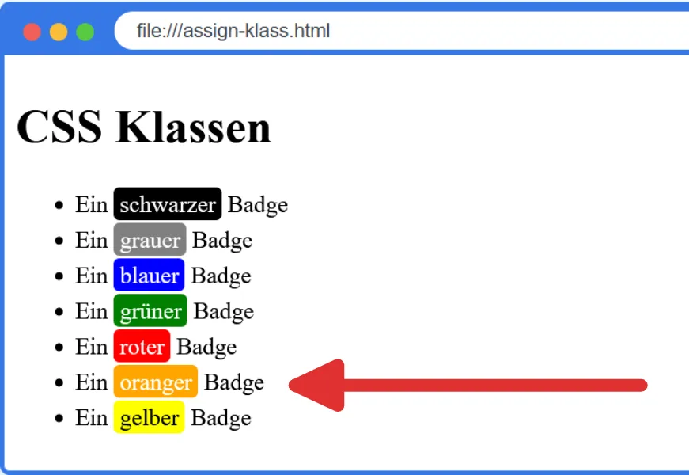

import HtmlEditor from '@tdev-components/documents/CodeEditor/HtmlEditor';
import ProgressState from '@tdev-components/documents/ProgressState';

# Klassen

Mit CSS-Klassen können CSS-Regeln auf HTML-Elemente angewendet werden, ohne dass diese Elemente einen bestimmten Tag-Namen haben müssen. Klassen werden mit einem Punkt (`.`) gefolgt vom Klassennamen definiert. Jedes Element, welches diese Klasse besitzt, wird von den entsprechenden CSS-Regeln beeinflusst.


<HtmlEditor
  hideWarning
  title='css-classes.html'
  lang='html'
>
```html
<html>
<head>
    <style>
        .highlight {
            background-color: yellow;
            font-weight: bold;
        }
        .badge {
            border: 2px solid darkblue;
            background-color: darkblue;
            border-radius: 5px;
            color: white;
            &.red {
                background-color: darkred;
                border-color: darkred;
            }
        }
    </style>
</head>
<body>
    <h1 class="highlight">HTML</h1>
    <div>
        Ein <code class="badge">div</code>-Tag steht 
        für <span class="badge red">Division</span>, 
        also für einen Bereich mit
        <span class="highlight">beliebigem Inhalt</span>.
        <p>
            Ein <code class="badge">span</code>-Tag steht 
            für einen <span class="badge red">Bereich</span> 
            innerhalb einer <span class="badge red">Zeile</span> mit 
            <span class="highlight">beliebigem Inhalt</span>.
        </p>
    </div>
</body>
</html>
```
</HtmlEditor>

:::info[Bemerke]
- Klassen können auf beliebige HTML-Elemente angewendet werden, unabhängig vom Tag-Namen
- Ein Element kann mehrere Klassen besitzen, indem die Klassennamen durch Leerzeichen getrennt werden.
- Im CSS werden Klassen mit einem Punkt (`.`) gefolgt vom Klassennamen definiert, z.B. `.highlight`.
:::

## Aufgabe 1

::::aufgabe[1: CSS-Klassen zuweisen]
<ProgressState id="e2081de4-89b1-4fd8-9550-b41d84b28af2" confirm float='right'>
1. Weisen Sie den Badges in der Liste die zu den Farben passenden Klassen hinzu, so dass sie die im CSS definierten Farben erhalten.

    

    :::details[Hinweis: `<span>`-Elemente]
    Damit die Klasse `badge` vergeben werden kann, muss der Text `schwarzer`, `grauer`, etc. jeweils in ein `span`-Element eingeschlossen werden:
    ```html
    Ein <span>schwarzer</span> Badge
    ```

    So kann dann die Klasse `badge` dem `span`-Element hinzugefügt werden.
    :::
2. Fügen Sie ein weiteres Listenelement "Ein oranger Badge" hinzu und erstellen Sie die CSS-Klasse für einen orangen Badge, so dass die Ausgabe dann wie folgt aussieht:

    
</ProgressState>
<HtmlEditor
  id="ad11c783-5b96-4001-8b27-685c3f8dd45d"
  lang='html'
  title='assign-klass.html'
  maxLines={40}
>
```html
<html>
<head>
    <style>
    .badge {
        color: white;
        border-radius: 4px;
        padding: 2px 4px;
        background-color: black;
        line-height: 1.5;
        &.grey {
            background-color: grey;
        }
        &.blue {
            background-color: blue;
        }
        &.red {
            background-color: red;
        }
        &.green {
            background-color: green;
        }
        &.yellow {
            color: black;
            background-color: yellow;
        }
    }
    </style>
</head>
<body>
    <h1>CSS Klassen</h1>
    <ul>
        <li>Ein schwarzer Badge</li>
        <li>Ein grauer Badge</li>
        <li>Ein blauer Badge</li>
        <li>Ein grüner Badge</li>
        <li>Ein roter Badge</li>
        <li>Ein gelber Badge</li>
    </ul>
  </body>
</html>
```
</HtmlEditor>

<Solution id="47a63cac-a611-41b6-b516-d6a20c917e95">
```html
<html>
<head>
    <style>
    .badge {
        color: white;
        border-radius: 4px;
        padding: 2px 4px;
        background-color: black;
        line-height: 1.5;
        &.grey {
            background-color: grey;
        }
        &.blue {
            background-color: blue;
        }
        &.red {
            background-color: red;
        }
        &.green {
            background-color: green;
        }
        &.orange {
            background-color: orange;
        }
        &.yellow {
            color: black;
            background-color: yellow;
        }
    }
    </style>
</head>
<body>
    <h1>CSS Klassen</h1>
    <ul>
        <li>Ein <span class="badge">schwarzer</span> Badge</li>
        <li>Ein <span class="badge grey">grauer</span> Badge</li>
        <li>Ein <span class="badge blue">blauer</span> Badge</li>
        <li>Ein <span class="badge green">grüner</span> Badge</li>
        <li>Ein <span class="badge red">roter</span> Badge</li>
        <li>Ein <span class="badge orange">oranger</span> Badge</li>
        <li>Ein <span class="badge yellow">gelber</span> Badge</li>
    </ul>
  </body>
</html>
```
</Solution>
::::

## Tailwind CSS Beispiel

[Tailwind CSS](https://tailwindcss.com/) ist ein CSS-Framework, das auf Utility-Klassen basiert. Anstatt eigene CSS-Klassen zu definieren, verwendet man vordefinierte Klassen, um das Styling direkt im HTML zu gestalten. Tailwind ist aktuell eines der [beliebtesten](https://stackcrawler.com/most-popular-css-frameworks) CSS-Frameworks, weshalb hier ein kleiner Einblick gezeigt wird.

Damit dies funktioniert, muss im `<head>`-Bereich der HTML-Datei das Tailwind CSS-Skript eingebunden werden:

```html
<html>
  <head>
      <!-- highlight-next-line -->
      <script src="https://cdn.jsdelivr.net/npm/@tailwindcss/browser@4"></script>
  </head>
  <body>
      ...
  </body>
</html>
```

Anschliessend können die vordefinierten Tailwind-Klassen verwendet werden, um das Layout und Design der HTML-Elemente zu gestalten.

:::cards{flexBasis=400px}
#### Reine HTML-Struktur
<HtmlEditor
  hideWarning
  title='tailwind.html'
  lang='html'
  minHeight={'200px'}
>
```html
<html>
<head>
</head>
<body>
<div>
    
    <div>
        <h1>Maria Grünfelder</h1>
        <address>
            <div>maria.gruenfelder@email.com</div>
            <div>Biel, Schweiz</div>
            <div>+41 32 123 4567</div>
        </address>
    </div>
</div>
</body>
</html>
```
</HtmlEditor>
::br
#### Mit Tailwind CSS
<HtmlEditor
  hideWarning
  title='tailwind.html'
  lang='html'
  minHeight={'200px'}
>
```html
<html>
<head>
    <script src="https://cdn.jsdelivr.net/npm/@tailwindcss/browser@4"></script>
</head>
<body>
<div class="flex items-center gap-x-6 m-5 p-6 bg-linear-to-r from-red-100 to-fuchsia-200 rounded-xl shadow-xl/30">
    
    <div class="">
        <h1 class="text-xl font-medium">Maria Grünfelder</h1>
        <address class="text-gray-500 not-italic text-sm">
            <div>maria.gruenfelder@email.com</div>
            <div>Biel, Schweiz</div>
            <div>+41 32 123 4567</div>
        </address>
    </div>
</div>
</body>
</html>
```
</HtmlEditor>
:::

import CvHtml from '!!raw-loader!./assets/cv.html';

::::aufgabe[2: Tailwind CSS ausprobieren]
<Answer type="state" id="4cb387e8-a50c-449c-913d-19aa3631cac4" />

Probieren Sie Tailwind CSS aus. Da Tailwind eine sehr grosse Anzahl an unterschiedlichen Utility-Klassen bietet, können Sie sich auf der [offiziellen Webseite](https://tailwindcss.com/docs) über die verschiedenen Klassen informieren.

Alternativ kann hier auch generativer AI-Support eingesetzt werden, allerdings sollte dabei wie folgt vorgegangen werden:
1. Als erste Nachricht folgenden Kontext eingeben.
    :::info[KI-Kontext für Tailwind CSS]
    ```prompt
    Ich besitze Grundwissen über HTML und kenne die Basics von CSS. Ich möchte Tailwind CSS lernen und habe bereits das Tailwind CSS über ein CDN in meine HTML-Datei eingebunden.
    Du bist mein Lernbegleiter und Coach zum erlernen von Tailwind CSS. Gib mir nicht einfach nur die Code-Snippets, sondern hilf mir Schritt für Schritt, welche Tailwind-Klassen ich wo einsetzen muss, um die gewünschten Effekte zu erzielen. Erkläre mir jeweils auch Abkürzungen und übersetze Fachbegriffe auf Deutsch. z.B. `m-5` bedeutet `margin: 1.25rem;` (also Aussenabstand von 20 Pixeln rundum). Beschränke dich auf die simpelste Lösung - Optimierungen für Fortgeschrittene oder mobile Ansichten können wir später angehen.
    Bevor du mir die Grundlagen erklärst, warte bis ich dir meine erste Frage stelle.
    ```
    :::
2. Präzise Fragen formulieren - Sie wollen lernen und verstehen, welcher Effekt mit was erreicht wird - reines Copy-Paste bringt Sie im Verständnis nicht weiter! z.B.  
    > Ich möchte mein Anzeigebild rund machen und etwa 50 pixel hoch und breit.

    > Wie kann ich das Bild und die Adresse nebeneinander anzeigen lassen?
3. Versuchen Sie, die Antworten zu verstehen und umzusetzen. Falls etwas unklar ist, fragen Sie gezielt nach.
    :::warning[HTML-Tags]
    Allenfalls ist die HTML-Grundstruktur der generativen AI nicht dieselbe wie bei Ihnen. Verstehen Sie dennoch, welche Tailwind-Klassen wo eingesetzt werden müssen, um den gewünschten Effekt zu erzielen?
    :::

<HtmlEditor id="86f07a24-3b4a-4999-a1bf-8540c6e8d5f2" lang="html" title="cv-tailwind.html" maxLines={40} code={CvHtml} />
::::

