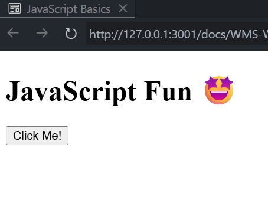
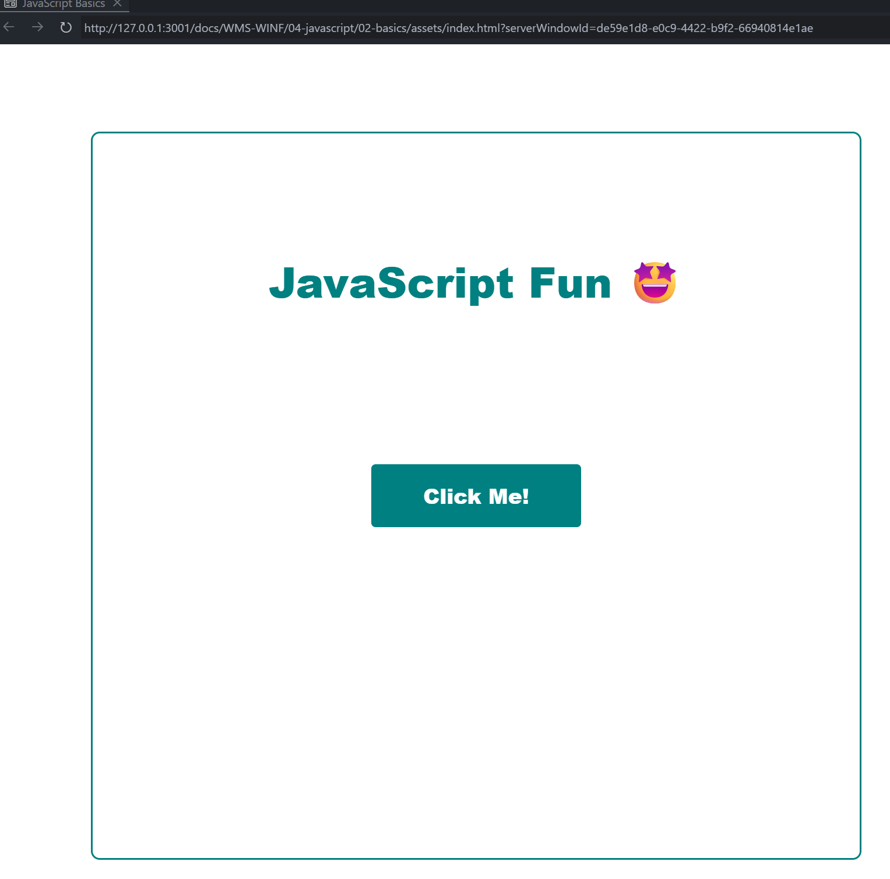

import HtmlEditor from '@tdev-components/documents/CodeEditor/HtmlEditor';
import ProgressState from '@tdev-components/documents/ProgressState';
import BrowserWindow from '@tdev-components/BrowserWindow';
import CodeBlock from '@theme/CodeBlock';
import Icon from '@mdi/react';

# Grundlagen

Webseiten basieren auf drei Technologien: HTML, CSS und JavaScript. Während HTML für die Struktur und CSS für das Aussehen der Webseite zuständig ist, sorgt JavaScript für die Interaktivität und dynamische Inhalte.

JavaScript ist eine Programmiersprache - es ist hier aber nicht das Ziel, Programmierer:in zu werden. Es soll einen grundlegenden Einblick geben und aufzeigen, wie JavaScript in Webseiten eingebunden und verwendet wird.

:::info[Ziele]
- Beispiele für das Hinzufügen- und Verändern von CSS (Stil und Klassen) mittels JavaScript.
- Beispiele für das Reagieren auf Benutzerinteraktionen (z.B. Klicks) mittels JavaScript.
- Verstehen, was JavaScript ist und wie es in Webseiten eingebunden wird.
:::

## Beispiele

### Style ändern

<HtmlEditor hideWarning>
```html
<ul>
    <li>Apfel</li>
    <li>Banane</li>
    <li>Orange</li>
</ul>
<button onclick="changeColor()">
    Farbe ändern
</button>
<script>
    function changeColor() {
        const items = document.querySelectorAll('li');
        items.forEach(item => {
            item.style.color = 'red';
        });
    }
</script>
```
</HtmlEditor>

:::::note[Hinweise]
<div className="compactDeflist">

Z. 6
: Das `onclick`-Attribut im `<button>`-Tag ruft die Funktion `changeColor()` auf, wenn der Button geklickt wird.
Z. 9
: Mit dem `<script>`-Tag wird JavaScript-Code in das HTML-Dokument eingebunden. Hier gilt eine andere __Syntax__ als bei HTML und CSS.
Z. 10
: Die Funktion `changeColor()` wird definiert. Der Funktionsname kann frei gewählt werden, muss aber mit dem im `onclick`-Attribut übereinstimmen.
: Die **runden Klammern** `()` gehen leicht vergessen, sind aber notwendig, um anzuzeigen, dass es sich um eine Funktion handelt.
Z. 11
: `document.querySelectorAll('li')` wählt alle `<li>`-Elemente im Dokument aus und speichert sie in der Variablen `items`.
: `items` enthält also eine Liste mit den drei Listenelementen `[<li>Apfel</li>, <li>Banane</li>, <li>Orange</li>]`.
Z. 12
: mit `items.forEach(...)` wird für jedes Element in der Liste eine Aktion ausgeführt, wobei das aktuell prozessierte Element über `item` zugänglich ist.
Z. 13
: Mit `item.style.color = 'red';` wird die Textfarbe des aktuellen Listenelements auf Rot gesetzt.
: Die Punkte können als Schritte verstanden werden:
::::dd
  1. `item` steht für das aktuelle Listenelement (z.B. `<li>Apfel</li>`).
  2. `.style` greift auf die CSS-Stile des Elements zu, also z.B. auf `<li style="...">Apfel</li>`
  3. Die Eigenschaft `color` wird auf `'red'` gesetzt, also `<li style="color: red;">Apfel</li>`.
    :::warning[Schreibweise]
    in JavaScript wird `.color = 'red'` mit einem **Gleichheitszeichen** und **Anführungszeichen** um `'red'` verwendet, während in CSS `color: red;` geschrieben wird.
    :::
::::

</div>
:::::

Einmal geklickt, ändert sich die Farbe aller Listenelemente zu Rot, aber beim erneuten Klicken passiert nichts mehr. Dies soll angepasst werden - die Farbe soll bei jedem Klick wechseln.


<HtmlEditor hideWarning>
```html
<ul>
    <li>Apfel</li>
    <li>Banane</li>
    <li>Orange</li>
</ul>
<button onclick="changeColor()">
    Farbe ändern
</button>
<script>
    function changeColor() {
        const items = document.querySelectorAll('li');
        items.forEach(item => {
            if (item.style.color == 'red') {
                item.style.color = 'black';
            } else {
                item.style.color = 'red';
            }
        });
    }
</script>
```
</HtmlEditor>

:::note[Hinweise]
<div className="compactDeflist">

Z. 13-18
: Es wurde eine `if`-Abfrage hinzugefügt, die prüft, ob die Farbe des Listenelements bereits Rot ist.
: Mit dem `==` Operator wird auf Gleichheit geprüft, da der `=` Operator bereits für Zuweisungen (`style.color = 'red'`) verwendet wird.
: Es beantwortet also die Frage: "Ist die Farbe Rot?" - wenn Ja, mache Z.14, sonst (`else`) Z.16.
Z. 14
: Die Farbe wird auf Schwarz gesetzt.
Z. 16
: Die Farbe wird auf Rot gesetzt.
</div>
:::

### Klasse ändern


<HtmlEditor hideWarning>
```html
<style>
    ul {
        list-style-type: "⬜";
        .checked {
            list-style-type: "✅";
            text-decoration: line-through;
            color: gray;
        }
    }
</style>
<h1>Meine Liste</h1>
<ul>
    <li>Apfel</li>
    <li>Banane</li>
    <li>Orange</li>
</ul>
<script>
    document.querySelectorAll('li').forEach(element => {
        element.onclick = function toggle() {
            element.classList.toggle('checked');
        };
    });
</script>
```
</HtmlEditor>

::::note[Hinweise]
<div className="compactDeflist">

Z. 3
: Das Standard Listensymbol wird mit `list-style-type: "⬜";` auf ein weisses Quadrat gesetzt.
Z. 4-8
: Die CSS-Klasse `.checked` wird definiert, die
:::dd
- das Listensymbol auf ein grünes Häkchen ändert,
- den Text durchstreicht und
- die Textfarbe auf Grau ändert.
:::
Z. 18
: Es wird wiederum über alle Listenelemente iteriert - das aktuelle Element ist über `element` zugänglich.
Z. 19
: Damit nicht händisch für jedes Listenelement ein `onclick`-Attribut gesetzt werden muss, wird dies hier programmgesteuert gemacht.
: Für jedes Listenelement wird die `onclick`-Eigenschaft auf die Funktion `toggle` gesetzt, die beim Klicken ausgeführt wird.
Z. 20
: `element.classList.toggle('checked');` fügt die CSS-Klasse `checked` hinzu (also `<li class="checked">`), wenn sie nicht vorhanden ist, und entfernt sie, wenn sie bereits vorhanden ist.

</div>

::::

## Ressourcen aufteilen

:::info[Bisher]
Bisher wurden alle Elemente - HTML, CSS und jetzt auch JavaScript - in einer einzigen HTML-Datei definiert. Dies ist für kleine Beispiele in Ordnung, aber bei grösseren Webseiten wird es schnell unübersichtlich. Wie können die Ressourcen aufgeteilt werden?
:::

HTML ist die Grundlage einer Webseite, die HTML-Datei wird immer als erstes angefordert und geladen. CSS und JavaScript können in separaten Dateien ausgelagert werden und dann von der HTML-Datei eingebunden werden. Da die Einbindung von CSS und JavaScript **nichts mit dem eigentlichen Inhalt** der Webseite zu tun hat, werden diese Dateien im `<head>`-Bereich der HTML-Datei eingebunden. Der spezielle HTML-Tag `<link>` wird für die Einbindung von CSS-Dateien verwendet, während das `<script>`-Tag für die Einbindung von JavaScript-Dateien verwendet wird.

```html showLineNumbers
<html>
<head>
    <!-- highlight-start -->
    <link rel="stylesheet" href="./styles.css">
    <script src="./script.js" defer></script>
    <!-- highlight-end -->
</head>
<body>
    <h1>Willkommen auf meiner Webseite</h1>
    <p>Dies ist ein Beispiel für eine Webseite mit ausgelagertem CSS und JavaScript.</p>
</body>
</html>
```

:::note[Hinweise]
<div className="compactDeflist">

Z. 3
: Mit dem `<link>`-Tag wird die CSS-Datei `styles.css` eingebunden. Das `rel="stylesheet"`-Attribut gibt an, dass es sich um ein Stylesheet handelt, und das `href`-Attribut gibt den Pfad zur lokalen CSS-Datei an. Wie bei bildern können hier lokale oder externe Pfade angegeben werden.
Z. 4
: Mit dem `<script>`-Tag wird die JavaScript-Datei `script.js` eingebunden. Das `src`-Attribut gibt den Pfad zur lokalen JavaScript-Datei an.
: Das `defer`-Attribut sorgt dafür, dass das JavaScript erst ausgeführt wird, wenn das HTML-Dokument vollständig geladen ist. Dies verhindert Fehler, die auftreten können, wenn das JavaScript versucht, auf HTML-Elemente zuzugreifen, die noch nicht geladen wurden.

</div>
:::

import IndexHtml from '!!raw-loader!./assets/skeleton/index.html';
import Style from '!!raw-loader!./assets/skeleton/styles.css';
import JS from '!!raw-loader!./assets/skeleton/script.js';
import OpenPreviewIcon from '@tdev/helpers/icons/vscOpenPreview.svg';


::::aufgabe[Ausprobieren]

Projekt-Ordner
: __OneDrive/Informatik/js-fun__
Inhalts-Struktur
:::dd
```
js-fun
├── index.html
├── script.js
└── styles.css
```
:::

<ProgressState id="14644d0d-72c9-4b45-a685-c3fb56b68c88" confirm preventTogglingFutureSteps>

1. Erstellen Sie die drei Dateien im angegebenen Ordner und öffnen Sie __js-fun/__ in VS-Code.
2. Kopieren Sie die Inhalte der HTML-, CSS- und JS-Beispiele in die entsprechenden Dateien.
    :::details[HTML]
    <CodeBlock language="html" showLineNumbers children={IndexHtml} />
    :::
    :::details[CSS]
    <CodeBlock language="css" showLineNumbers children={Style} />
    :::
    :::details[JavaScript]
    <CodeBlock language="javascript" showLineNumbers children={JS} />
    :::
    Öffnen Sie die Vorschau der HTML-Datei <OpenPreviewIcon /> (falls nicht verfügbar: [Live Server](https://marketplace.visualstudio.com/items?itemName=ms-vscode.live-server) installieren).
    Die Seite sollte nun wie folgt aussehen:
    <BrowserWindow>
    
    </BrowserWindow>
    :::warning[Hinweis]
    Die CSS- und JS-Dateien sind noch nicht verknüpft.
    :::

3. Verknüpfen Sie nun die CSS- und JS-Dateien in der HTML-Datei wie oben gezeigt.  
    Die Seite sollte nun wie folgt aussehen:
    <BrowserWindow>
    
    </BrowserWindow>
4. Was passiert, wenn Sie auf den Button klicken? In welcher Datei und auf welcher Zeile ist dieser Effekt definiert?
    <Answer type="text" id="2c2a3003-7ddb-41ec-81d4-9789306f12e4" />
5. Können Sie den Effekt deaktivieren und dann den Button erneut klicken? Was passiert nun?
    <Answer type="text" id="d4b62a9a-cff0-4bef-8830-ff26b47cd4fb" />
6. Inhaltsstruktur anpassen: Bei Firmen-Webseiten werden die CSS- und JS-Dateien oft in eigene Unterordner ausgelagert. Passen Sie die Projekt-Struktur gemäss folgender Abbildung an und aktualisieren Sie die verlinkten Dokumente in der HTML-Datei entsprechend.
    Inhalts-Struktur
    :::dd
    ```
    js-fun
    ├── css
    │   └── styles.css
    ├── js
    │   └── script.js
    └── index.html
    ```
    :::
</ProgressState>
::::

## Zusammenfassung
:::insight[Takeaways]
- JavaScript ermöglicht interaktive und dynamische Inhalte auf Webseiten.
- Webseiten-Projekte können **übersichtlicher** strukturiert werden, indem HTML, CSS und JavaScript in **separate Dateien** ausgelagert werden.
    - Einbindungen werden im `<head>`-Bereich der HTML-Datei vorgenommen.
    - CSS-Dateien werden mit dem `<link>`-Tag eingebunden, z.B.
        ```html
        <link rel="stylesheet" href="./styles.css">
        ```
    - JavaScript-Dateien werden mit dem `<script>`-Tag eingebunden, mit dem `defer`-Attribut wird sichergestellt, dass alle Webseiten-Inhalte bereits geladen sind wenn das Skript ausgeführt wird. Beispiel
        ```html
        <script src="./script.js" defer></script>
        ```
:::
