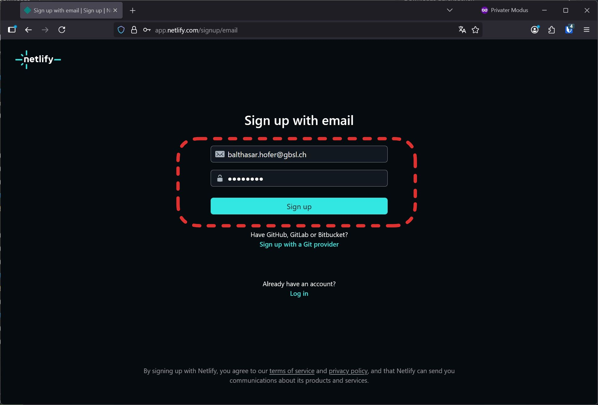
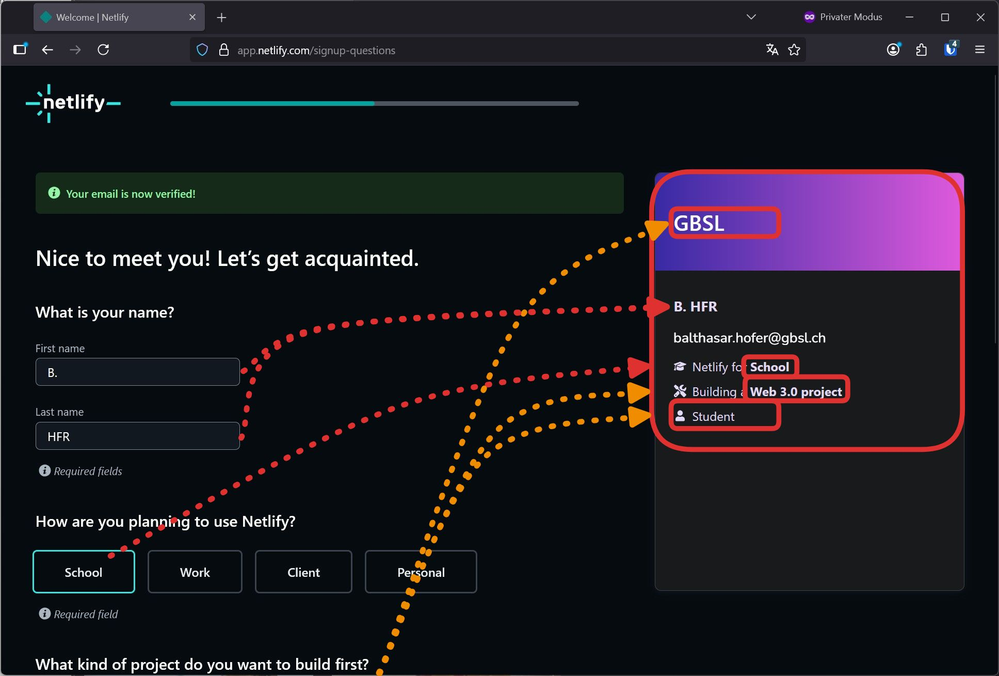
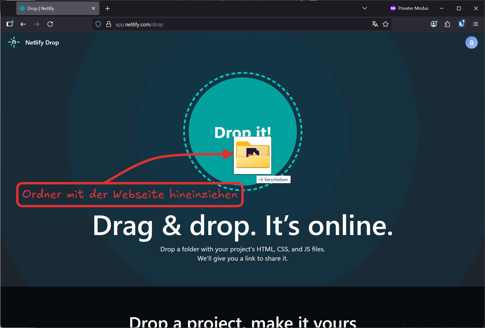
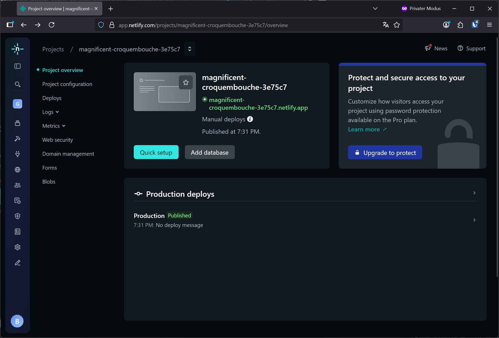

import ProgressState from '@tdev-components/documents/ProgressState';
import Dir from '@tdev-components/FileSystem/Dir';

# Netlify

Um eine Webseite online zu stellen, wird ein Webserver benötigt. Dieser Server muss ständig laufen, was Kosten verursacht. Netlify bietet kostenlose, statische Webserver an, die einfach zu bedienen sind. Dazu ist ein Netlify-Account notwendig.

:::aufgabe[Netlify-Account erstellen]
Netlify
: [Netlify Signup](https://app.netlify.com/signup/email)

<ProgressState id="0ce45eb7-83ed-436c-afd6-852670566351" preventTogglingFutureSteps>

1. 
2. 
3. Lassen Sie den Tab offen und klicken Sie noch nicht weiter herum - es geht in der nächsten Aufgabe genau hier weiter.

</ProgressState>
:::

Um eine Webseite zu veröffentlichen, erwartet ein Webserver eine Einstiegs-Webseite, welche als Startseite angezeigt wird.
Diese Datei heisst meistens `index.html`.

Der Webseiten-Ordner sollte also wie im Abschnitt [html](../../02-html/02-links/index.mdx) beschrieben aufgebaut sein und mindestens eine `index.html`-Datei enthalten.

<Dir
    open
    noSelect
    dir={{
        name: 'website',
        children: [
            'index.html',
            {
                name: 'images',
                children: [
                    'logo.jpg',
                    'me.png',
                ],
            }
        ]
    }}
/>

:::aufgabe[Webseite veröffentlichen]
<ProgressState id="d494e43a-3f1e-4c2a-84bb-e6b92a39bf19" preventTogglingFutureSteps>
1. Laden Sie Ihr CV herunter und erstellen Sie eine Ordner-Struktur wie oben gezeigt.
2. Laden Sie Ihre Seite auf Netlify hoch (achtung, sie ist nun öffentlich!)  
    
    
3. Netlify konfigurieren - aktuell ist Ihre Seite noch unter einer zufälligen Adresse erreichbar. Diese können Sie wie folgt ändern:
    
    
    
4. Webseite besuchen unter `https://<gewählter-name>.netlify.app`
</ProgressState>
:::

## Webseite updaten

