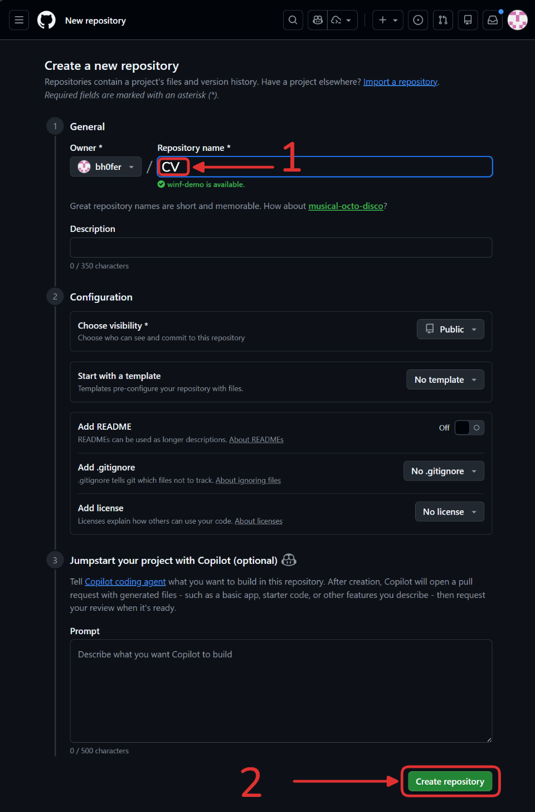
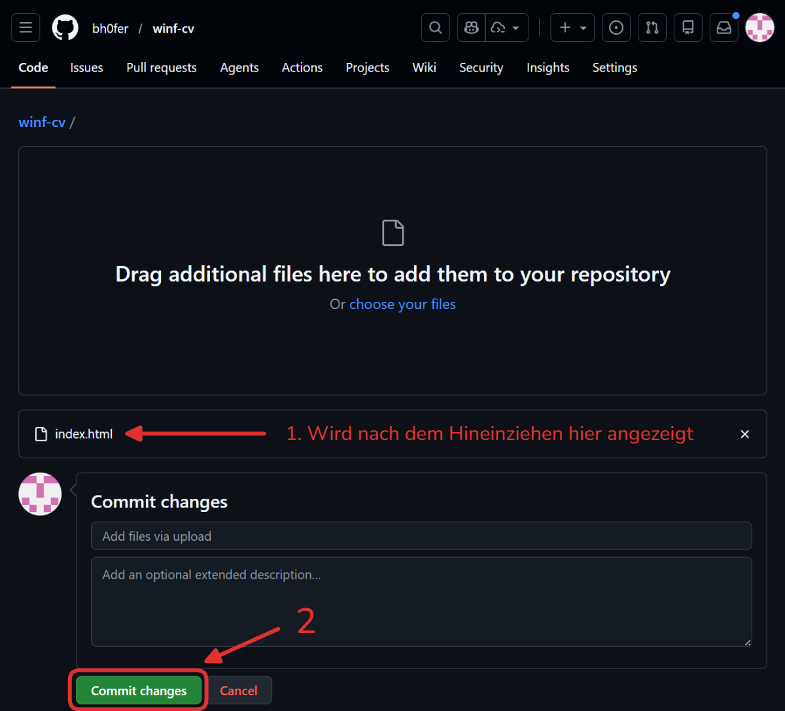
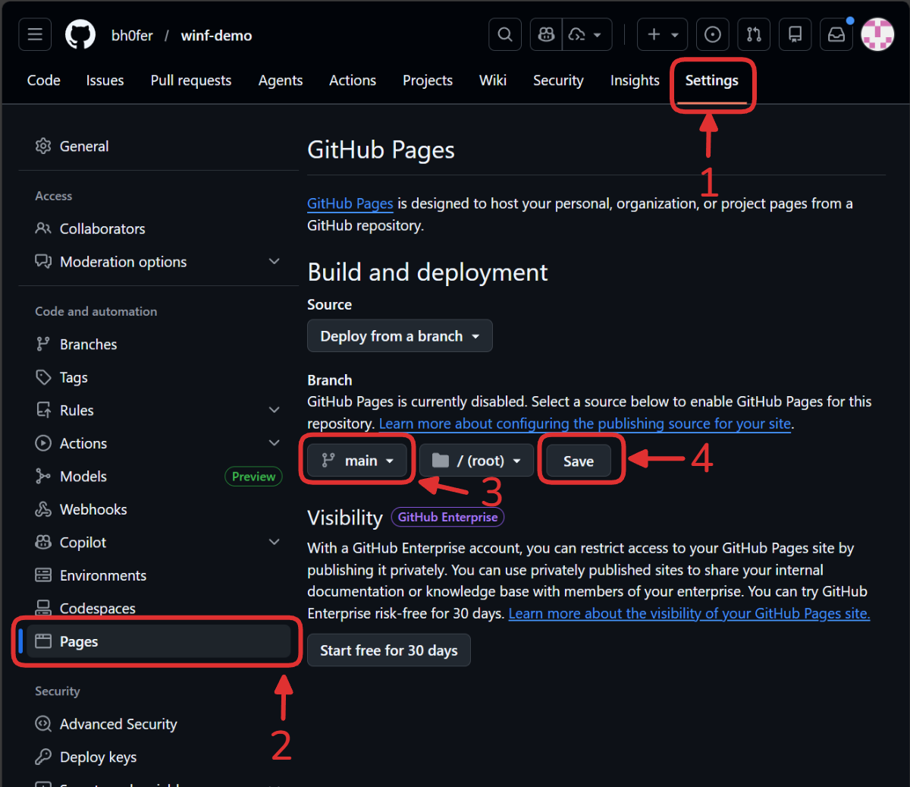
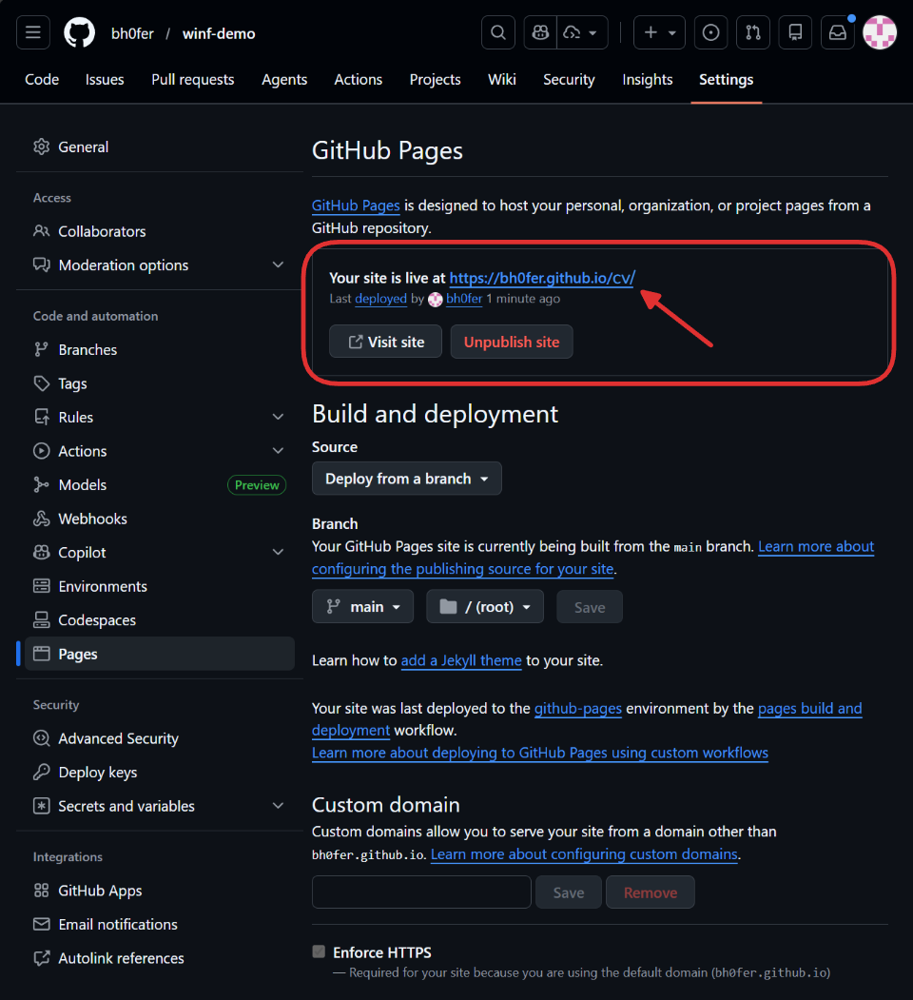
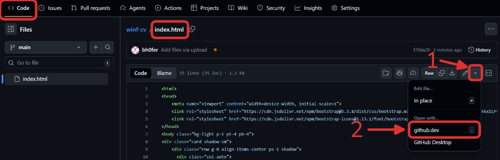
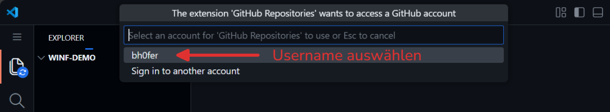
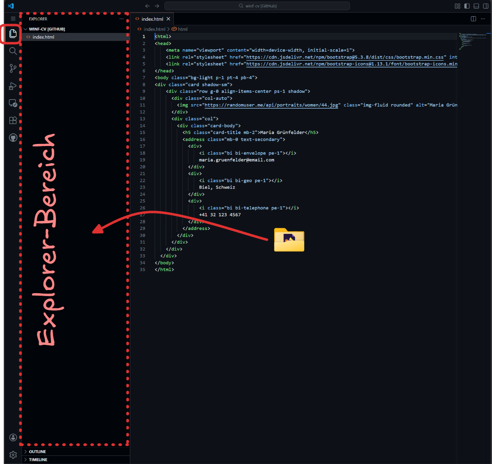
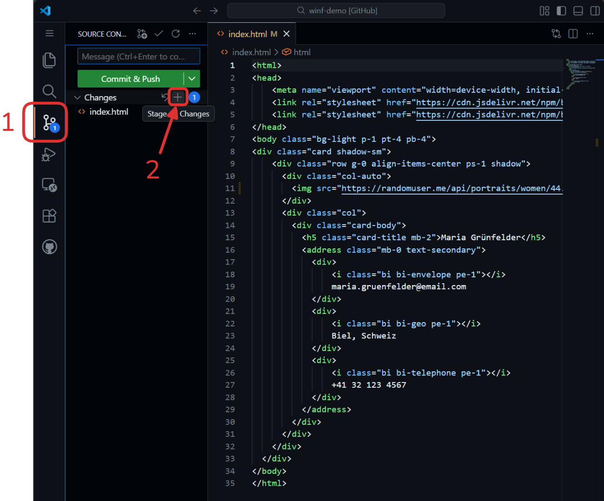
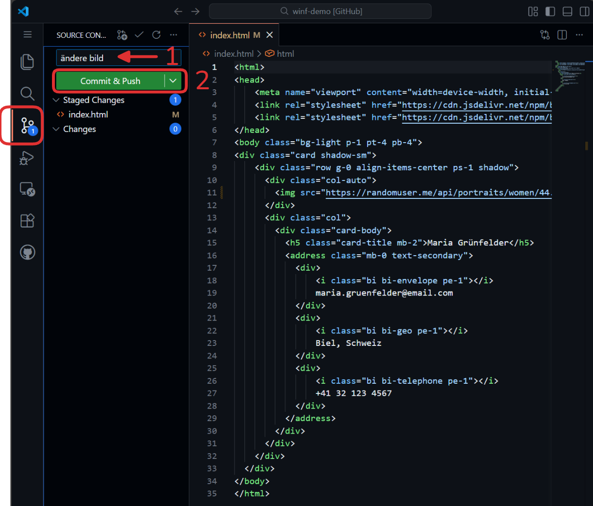
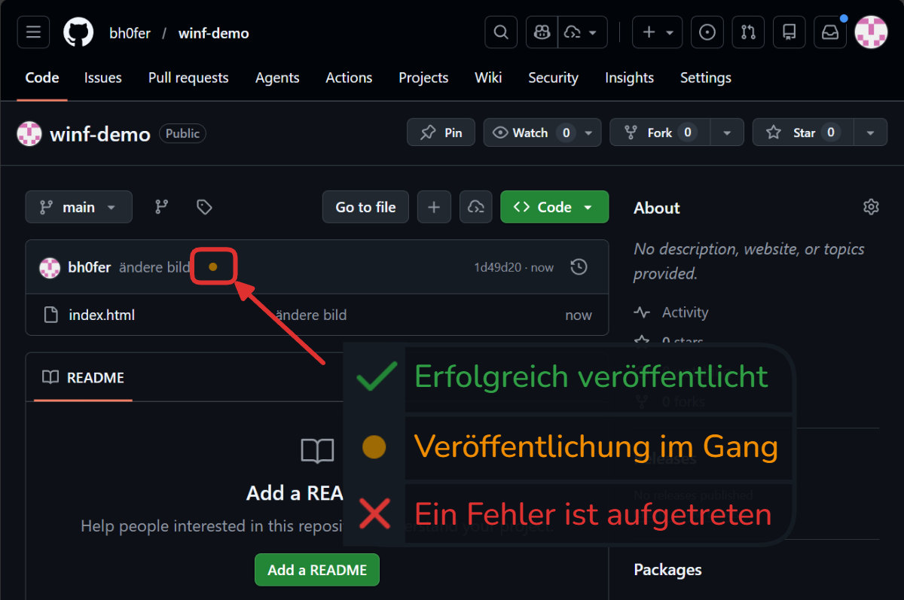

import ProgressState from '@tdev-components/documents/ProgressState';
import DownloadCode from '@tdev-components/documents/CodeEditor/Actions/DownloadCode';
import IndexHtml from '!!raw-loader!./assets/index.html';
import { observer } from 'mobx-react-lite';
import { useFirstMainDocument } from '@tdev-hooks/useFirstMainDocument';
import Link from '@docusaurus/Link'

# Github

<ProgressState id="fa1f6787-22db-40f7-84eb-1568089c8c15">

1. Ein [Github-Konto](https://github.com/signup) erstellen.
    - Verwenden Sie eine __persönliche E-Mail-Adresse__, um auch nach der Schulzeit Zugriff auf Ihr Konto zu haben.
    - Verwenden Sie einen __aussagekräftigen Benutzernamen__, der Sie repräsentiert - Ihre Webseiten werden später unter diesem Namen erreichbar sein.
2. Ein neues Repository erstellen: Navigieren Sie zu [https://github.com/new](https://github.com/new) und erstellen Sie ein neues Repository mit dem Namen __CV__.

    

3. Laden Sie  herunter

    Herunterladen
    : __index.html__ <DownloadCode code={{code: IndexHtml, title: 'index.html', lang: 'html'}} />
    Danach...
    : "uploading an existing file" klicken und die Datei __index.html__ auswählen.

    

    ... und die Änderungsbeschreibung festhalten (Commit changes):

    

4. Die Seite veröffentlichen:
    Unter __Settings > Pages > Branch__ den Branch __main__ und den Ordner __root__ auswählen und auf __Save__ klicken.

    

5. Die Seite neu laden (kann 2-3 Minuten dauern), bis es in etwa so aussieht und der Link zur Seite angezeigt wird:

    

6. Eigenes CV hochladen: Zum Reiter __Code__ navigieren und dann auf `index.html` klicken und das Dokument mit `github.dev` bearbeiten:

    

    

    

7. Den Inhalt anpassen: Durch Drag & Drop können nun Dokumente, Bilder oder auch ganze Ordner in den __Explorer__ des Online-Editors gezogen werden.

    

8. Um die Änderungen zu speichern und gleichzeitig auch die Webseite neu zu veröffentlichen, wird ein **Änderungspaket** erstellt. Dazu müssen
    - alle Dateien zum Änderungspaket hinzugefügt werden (*Stagen*, Plus-Symbol bei __Changes__ klicken)

        

    - eine kurze Änderungsnachricht verfasst werden (z.B. "Mein CV aktualisiert") und das Änderungspaket mit __Commit & Push__ abschicken.

        
    
9. Nach 1-2 Minuten die Webseite neu laden, um die Änderungen zu sehen. Ob die Seite erfolgreich veröffentlicht wurde, kann im Repository überprüft werden.

    

    Sollte ein Fehler auftreten, hilft oft ein erneutes Abschicken eines Änderungspakets (Schritt 8, dazu muss natürlich eine kleine Änderung vorgenommen werden).
</ProgressState>

export const ShowLink = observer(() => {
    const doc = useFirstMainDocument('a4544514-40e8-4539-9cec-be50fd773014', {}, false);
    if (!doc || !doc.text) {
        return null;
    }
    return (
        

            <Link href={doc.text} target="_blank">
                👉 {doc.text}
            </Link>
        

    );
})

:::aufgabe[CV auf Github veröffentlichen]
<Answer type="state" id="35fdd741-950b-4e59-8f13-d7766a6e3a5b" />

Veröffentlichen Sie Ihr CV auf Github, indem Sie die oben beschriebenen Schritte durchführen. Allenfalls können Sie einzelne Teile auch anonymisieren (z.B. Name, Adresse, Telefonnummer).

Halten Sie die URL zu Ihrer veröffentlichten Webseite fest.

<String type="url" label="url" fullWidth id="a4544514-40e8-4539-9cec-be50fd773014" />

<ShowLink />
:::
