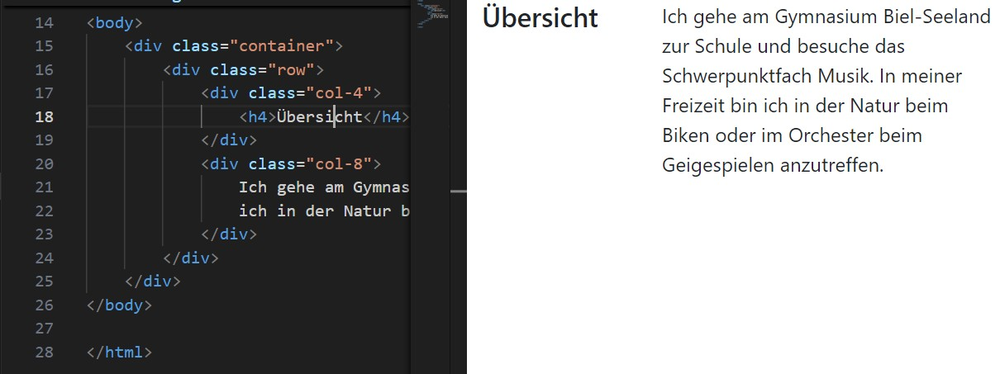
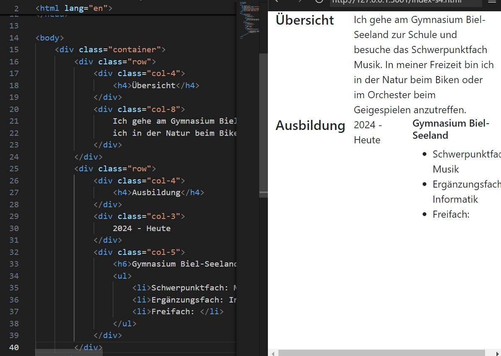
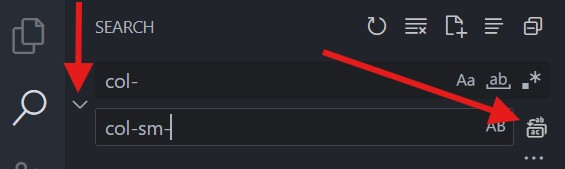
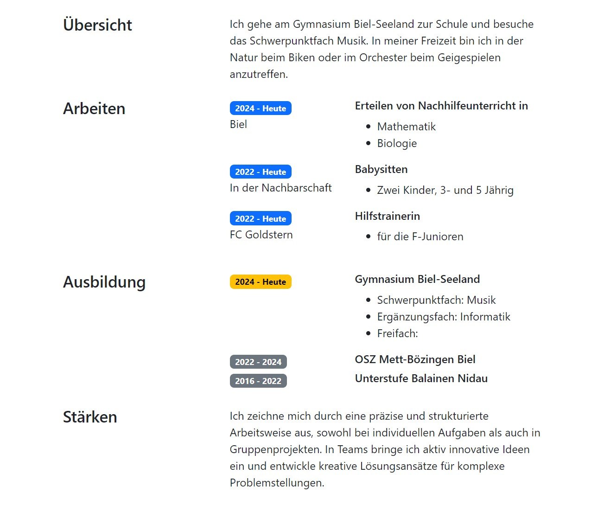
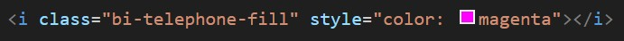
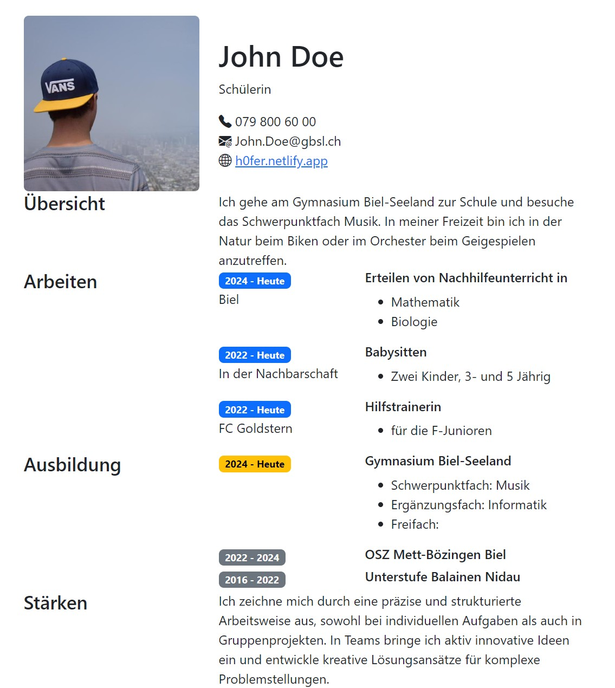
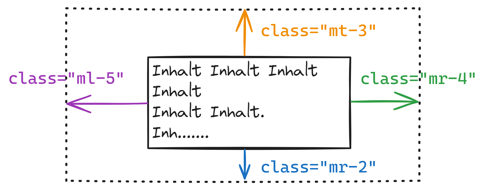

import HtmlEditor from '@tdev-components/documents/CodeEditor/HtmlEditor';
import ProgressState from '@tdev-components/documents/ProgressState';
import CodeBlock from '@theme/CodeBlock';

# Bootstrap

:::cards{flexBasis=250px}
::br{backgroundColor=var(--ifm-color-success-lightest)}
**Highlights**
- Umfassende, vorgefertigte Komponenten & Layouts sofort nutzbar
- Sehr hohe Verbreitung
- Automatische Responsiveness-Features     
- Erfordert wenig eigenes CSS
::br{backgroundColor=var(--ifm-color-danger-lightest)}
**Nachteile**
- Oft "Bootstrap-Look", schwierig komplett individuell zu stylen  
- Anpassung/Abweichung vom Standarddesign häufig aufwändig
- Grösserer CSS-Overhead
:::

[Bootstrap](https://getbootstrap.com/) ist ein CSS-Framework, das auf vorkonfigurierten Komponenten und Layout-Klassen basiert. Anstatt jedes Element von Grund auf selbst zu stylen, nutzt man eine Vielzahl vordefinierter Klassen, um schnell ansprechende und responsive Benutzeroberflächen zu erstellen.
Damit dies funktioniert, müssen im `<head>`-Bereich der HTML-Datei die Bootstrap CSS-Skripts eingebunden werden.

```html showLineNumbers
<html>
  <head>
      <!-- highlight-start -->
    <meta name="viewport" content="width=device-width, initial-scale=1">
    <link rel="stylesheet" href="https://cdn.jsdelivr.net/npm/bootstrap@5.3.8/dist/css/bootstrap.min.css" integrity="sha384-sRIl4kxILFvY47J16cr9ZwB07vP4J8+LH7qKQnuqkuIAvNWLzeN8tE5YBujZqJLB" crossorigin="anonymous">
    <link rel="stylesheet" href="https://cdn.jsdelivr.net/npm/bootstrap-icons@1.13.1/font/bootstrap-icons.min.css">
      <!-- highlight-end -->
  </head>
  <body>
      ...
  </body>
</html>
```

Zusätzlich wird auf **Z. 3** das `meta viewport` Tag eingefügt, damit Webseiten auch auf mobilen Geräten korrekt skaliert werden.

:::tip[Online-Installationsanleitung Bootstrap]
- [Bootstrap Installation](https://getbootstrap.com/), Methode "CDN"
- [Bootstrap Icons](https://icons.getbootstrap.com/#install), Methode "CDN"
:::

Anschliessend können die vordefinierten Bootstrap-Klassen und Komponenten verwendet werden, um das Layout und Design der HTML-Elemente zu gestalten.

::::cards{flexBasis=400px}
**Reine HTML-Struktur**
<HtmlEditor
  hideWarning
  title='bootstrap.html'
  lang='html'
  minHeight={'200px'}
>
```html
<html>
<head>


</head>
<body>
<div>
    
    <div>
        <h1>Maria Grünfelder</h1>
        <address>
            <div>maria.gruenfelder@email.com</div>
            <div>Biel, Schweiz</div>
            <div>+41 32 123 4567</div>
        </address>
    </div>
</div>
</body>
</html>
```
</HtmlEditor>
::br
**Mit Bootstrap CSS**
<HtmlEditor
  hideWarning
  title='bootstrap.html'
  lang='html'
  minHeight={'200px'}
>
```html
<html>
<head>
    <meta name="viewport" content="width=device-width, initial-scale=1">
    <link rel="stylesheet" href="https://cdn.jsdelivr.net/npm/bootstrap@5.3.8/dist/css/bootstrap.min.css" integrity="sha384-sRIl4kxILFvY47J16cr9ZwB07vP4J8+LH7qKQnuqkuIAvNWLzeN8tE5YBujZqJLB" crossorigin="anonymous">
    <link rel="stylesheet" href="https://cdn.jsdelivr.net/npm/bootstrap-icons@1.13.1/font/bootstrap-icons.min.css">
</head>
<body class="bg-light p-1 pt-4 pb-4">
<div class="card shadow-sm">
    <div class="row g-0 align-items-center ps-1 shadow">
      <div class="col-auto">
        
      </div>
      <div class="col">
        <div class="card-body">
          <h5 class="card-title mb-2">Maria Grünfelder</h5>
          <address class="mb-0 text-secondary">
            <div>
                <i class="bi bi-envelope pe-1"></i>
                maria.gruenfelder@email.com
            </div>
            <div>
                <i class="bi bi-geo pe-1"></i>
                Biel, Schweiz
            </div>
            <div>
                <i class="bi bi-telephone pe-1"></i>
                +41 32 123 4567
            </div>
          </address>
        </div>
      </div>
    </div>
  </div>
</body>
</html>
```
</HtmlEditor>
:::tip[Bemerke: keine Zeile CSS nötig]
Es wurden ausschliesslich das Attribut `class=` hinzugefügt und die entsprechenden Bootstrap-Klassen verwendet. Es wurde keine Zeile CSS geschrieben.
:::
::::


## Ein Lebenslauf mit Bootstrap

Es soll eine kleine Webseite mit dem eigenen Lebenslauf erstellt werden. Vorerst wird folgende Webseite aufgebaut, die Inhalte und Farben können später angepasst werden.

:::cards{maxWidth="500px" margin="0 auto"}

:::

import MoreContentHtml from '!!raw-loader!./assets/5-more-content.html';

<ProgressState 
    id='8cc5fb17-8015-4ebc-8e2c-af2451e12001'
    preventTogglingFutureSteps
    confirm
    labels={[
        '1. Grundgerüst mit Bootstrap einrichten',
        '2. Inhalt hinzufügen',
        '3. Bootstrap Klassen',
        '4. Ausbildung',
        '5. Weitere Zeilen und Abschnitte',
        '6. Überschrift mit Foto',
        '7. Abschluss'
    ]}
>

1. Grundgerüst
    Ordner
    : __OneDrive - EDUBERN/Informatik/Webseite/__
    Dateiname
    : __cv.html__ (für "Curriculum Vitae")

    ```html title="cv.html"
    <!doctype html>
    <html lang="en">
    <head>
        <meta charset="utf-8">
        <meta name="viewport" content="width=device-width, initial-scale=1">
        <link rel="stylesheet" href="https://cdn.jsdelivr.net/npm/bootstrap@5.3.8/dist/css/bootstrap.min.css" integrity="sha384-sRIl4kxILFvY47J16cr9ZwB07vP4J8+LH7qKQnuqkuIAvNWLzeN8tE5YBujZqJLB" crossorigin="anonymous">
        <link rel="stylesheet" href="https://cdn.jsdelivr.net/npm/bootstrap-icons@1.13.1/font/bootstrap-icons.min.css">
    </head>
    <body>

    </body>
    </html>
    ```
    :::aufgabe
    Kopieren Sie den gesamten Inhalt und fügen Sie ihn in die Datei __cv.html__ ein.
    :::
2. Inhalt hinzufügen
    :::warning[`<body>`]
    Ab jetzt bezieht sich der gezeigt HTML-Code immer nur auf den Inhalt zwischen den `<body>` Tags.
    :::
    ```html title="cv.html"
    <div>
        <div>
            <div>
                <h4>Übersicht</h4>
            </div>
            <div>
                Ich gehe am Gymnasium Biel-Seeland zur Schule und besuche das Schwerpunktfach Musik. In meiner Freizeit bin
                ich in der Natur beim Biken oder im Orchester beim Geigespielen anzutreffen.
            </div>
        </div>
    </div>
    ```
    :::aufgabe
    Fügen Sie den gezeigten HTML-Code zwischen die `<body></body>` Tags ein. Überprüfen Sie, dass die Webseite in VS-Code in der Live-Vorschau wie folgt angezeigt wird.

    
    :::
3. Bootstrap Klassen
    Nun soll Übersicht hübscher dargestellt werden. Dazu werden nun einige Bootstrap-Klassen hinzugefügt. Speichern Sie nach jedem Schritt und beobachten Sie die Änderungen in der Live-Vorschau.
    :::warning[Nur die Änderungen in den markierten Zeilen übernehmen!]
    :::
    <ProgressState labels={['3.1 Container', '3.2 Zeilen und Spalten']} preventTogglingFutureSteps id="f8fa65b1-cf12-4d34-ab12-79cd734a6079">
    1. 
        ```html {1}
        <div class="container">
            <div>
                <div>
                    <h4>Übersicht</h4>
                </div>
                <div>
                    Ich gehe am Gymnasium Biel-Seeland zur Schule und besuche das Schwerpunktfach Musik. In meiner Freizeit bin
                    ich in der Natur beim Biken oder im Orchester beim Geigespielen anzutreffen.
                </div>
            </div>
        </div>
        ```
    2. 
        Mit der Klasse `row` wird eine Zeile definiert - in Bootstrap ist eine Zeile in __12__ gleichgrosse Spalten unterteilt. Mit der Klasse `col-4` wird dann beschrieben, dass das erste `<div>` 4 Spalten gross, das zweite `<div>` 8 Spalten gross sein soll.

        


        ```html {2,3,6}
        <div class="container">
            <div class="row">
                <div class="col-4">
                    <h4>Übersicht</h4>
                </div>
                <div class="col-8">
                    Ich gehe am Gymnasium Biel-Seeland zur Schule und besuche das Schwerpunktfach Musik. In meiner Freizeit bin
                    ich in der Natur beim Biken oder im Orchester beim Geigespielen anzutreffen.
                </div>
            </div>
        </div>
        ```
        :::aufgabe
        Fügen Sie die Klassen `row` und `col-4` und `col-8` hinzu und überprüfen Sie die Änderungen in der Live-Vorschau.

        
        :::
    </ProgressState>
4. Ausbildung
    Der Abschnitt "Ausbildung" soll nun hinzugefügt werden. Fügen Sie den folgenden HTML-Code ein:
    <ProgressState labels={['4.1 Ausbildung', '4.2 Jahreszahlen', '4.3 Überlappungen']} preventTogglingFutureSteps id="abff09cb-3faf-473f-9a13-d08f6238231c">
        1. Neue Zeile für die Ausbildungen hinzufügen
            ```html {2,5,8}
            <div class="row">
                <div class="col-4">
                    <h4>Ausbildung</h4>
                </div>
                <div class="col-3">
                    2024 - Heute
                </div>
                <div class="col-5">
                    <h6>Gymnasium Biel-Seeland</h6>
                    <ul>
                        <li>Schwerpunktfach: Musik</li>
                        <li>Ergänzungsfach: Informatik</li>
                        <li>Freifach: </li>
                    </ul>
                </div>
            </div>
            ```
            :::insight[Unterteilung der 12 Spalten]
            **Bemerke**: Die Summe der Spaltenbreiten muss 12 ergeben. In diesem Fall sind es die Klassen `col-4`, `col-3` und `col-5` die also die ganze Spaltenbreite von $4 + 3 + 5 = 12$ ausnutzen.
            :::
        2. Farbige Jahreszahl
            Die Jahreszahl soll farbig dargestellt werden. Dazu wird ein <span className="badge badge--primary">Badge</span> verwendet. Damit dies gelingt, werden die Jahreszahlen mit einem `<span>`-Element umgeben (erzeugt im Gegensatz zum `<div>` keine neue Zeile) und die folgenden Klassen werden hinzugefügt:

            ```html {2}
            <div class="col-3">
                <span class="badge text-bg-primary">2024 - Heute</span>
            </div>
            ```

            :::info[Abkürzungen]
            Bemerke: `text-bg-primary` ist eine Abkürzung für `text background primary`: setzt also den Hintergrund auf die primäre Farbe (standardmässig blau).
            :::

            :::success[Weitere Farben]
            Es gibt noch weitere Farben, die verwendet werden können: `secondary`, `success`, `danger`, `warning`, `info`, `light`, `dark`. [Mehr dazu](https://getbootstrap.com/docs/5.3/components/badge/#background-colors)
            :::
            :::aufgabe
            Fügen Sie den gezeigten HTML-Code ein und überprüfen Sie die Änderungen in der Live-Vorschau.
            
            :::
        3. Überlappungen
            Ändere die Grösse der Vorschau - was stellen Sie fest?

            ::video[./images/overlapping.mp4]{max-width=400px margin="1em auto" display=block loop autoplay}

            :::success[Responsive Design]
            Bootstrap ist so konzipiert, dass es auf verschiedenen Bildschirmgrössen gut aussieht. Das bedeutet, dass die Spaltenbreiten sich anpassen, wenn der Bildschirm schmaler wird. In diesem Fall werden die Spalten übereinander angezeigt.
            :::

            Um das Responsive-Design anzuwenden, muss jeder Spalte mitgeteilt werden, ab welcher Bildschirmgrösse das volle Spaltenlayout verwendet werden soll. Dazu muss jede `col-` Klasse durch `col-sm-` ersetzt werden. Das bedeutet, dass die Spalten ab einer Bildschirmgrösse von `sm` (small) nebeneinander angezeigt werden, alles was kleiner ist, dann aber übereinander. [Weitere Grössen](https://getbootstrap.com/docs/5.3/layout/grid/#grid-options).

            ```html {2,5,8}
            <div class="row">
                <div class="col-sm-4">
                    <h4>Ausbildung</h4>
                </div>
                <div class="col-sm-3">
                    2024 - Heute
                </div>
                <div class="col-sm-5">
                    <h6>Gymnasium Biel-Seeland</h6>
                </div>
            </div>
            ```
            :::aufgabe
            Ersetzen Sie alle `col-` Klassen durch `col-sm-` und überprüfen Sie die Änderungen in der Live-Vorschau. Verwenden Sie dazu Suchen/Ersetzen in VS Code: [[Ctrl + F]].
            
            :::    
        </ProgressState>
5. Weitere Zeilen und Abschnitte

    Fügen Sie die weiteren Abschnitte hinzu, die `Badges` können Sie farblich selber aus den gegebenen Optionen auswählen:

    - <span className="badge badge--primary" style={{['--ifm-color-primary']: 'var(--ifm-color-blue)'}}>badge text-bg-primary</span>
    - <span className="badge badge--secondary">badge text-bg-secondary</span>
    - <span className="badge badge--success">badge text-bg-success</span>
    - <span className="badge badge--danger">badge text-bg-danger</span>
    - <span className="badge badge--warning">badge text-bg-warning</span>
    - <span className="badge badge--info">badge text-bg-info</span>

    :::warning[Nur die markierten Abschnitte hinzufügen!]
    :::
        
    <CodeBlock language="html" showLineNumbers>
        {MoreContentHtml}
    </CodeBlock>

    :::warning[Z. 74]
    Beachte: Auf Zeile 74 wurde ein leeres `<div class="col-sm-4"></div>` hinzugefügt (Ebenso auf den Zeilen 28,43 und 83). Sie dienen als **Platzhalter** und müssen hinzugefügt werden, auch wenn unterhalb von "Arbeiten" und "Ausbildung" keine Inhalte vorhanden sind.
    :::

    :::aufgabe
    Fügen Sie die weiteren Abschnitte hinzu, wobei Sie
    - die Eckdaten für Ihre Person anpassen
    - ggf. nicht verwendete Einträge (Trainerin FC Goldstern?) entfernen, passende hinzufügen
    - selbst gewählte Farben für die Badges verwenden

    Überprüfen Sie die Änderungen in der Live-Vorschau.

    
    :::
6. Überschrift mit Foto
    Als letztes wird die Überschrift hinzugefügt. Dazu braucht es ein Bild von Ihnen, welches Sie im Ordner `images` ablegen. Betrachten Sie dann den untenstehenden Code:

    ```html {3,10,19} showLineNumbers
    <div class="row align-items-center">
        <div class="col-sm-4">
            
        </div>
        <div class="col-sm-8">
            <h1>John Doe</h1>
            <p>Schülerin</h4>
            <div class="row">
                <div class="col-lg-4">
                    <i class="bi-telephone-fill"></i>
                    079 800 60 00
                </div>
                <div class="col-lg-4">
                    <i class="bi bi-envelope-at-fill"></i>
                    John.Doe@gbsl.ch
                </div>
                <div class="col-lg-4">
                    <i class="bi bi-globe2"></i>
                    <a href="https://h0fer.netlify.app">h0fer.netlify.app</a>
                </div>
            </div>
        </div>
    </div>
    ```
    :::info
    <div className="compactDeflist">
    Zeile 3
    : Das Bild wird hinzugefügt. Durch die Klasse `rounded` werden die Bild-Ecken abgerundet und mit `img-fluid` wird die Grösse automatisch an den zur Verfügung stehenden Platz angepasst.
    Zeile 10
    : Hier wird ein Icon eingefügt - weitere Icons finden Sie [hier](https://icons.getbootstrap.com/).
    : Mit dem Attribut `style` können beliebige Farben verwendet werden
    : 
    Zeile 19
    : Ein Link auf die eigene Webseite wird hinzugefügt - im `href` steht der richtige Link, zwischen den Tags der angezeigte Name.
    </div>
    :::aufgabe
    Fügen Sie Ihrem CV ein Bild hinzu und passen Sie die Eckdaten an. Überprüfen Sie die Änderungen in der Live-Vorschau.

    
    :::
7. Abschluss
    Inhaltlich sind wir fertig! Die einzelnen Abschnitte sind aber aktuell noch sehr nahe beieinander 😵‍💫. Dies kann man durch das Hinzufügen von `margin` ändern.

    

    Der Abstand eines Elements kann auf jede Seite einzeln festgelegt werden. Mit `m-4` kann der Abstand mit nur einem Befehl auf allen Seiten auf denselben Wert festgelegt werden. Die Zahlen von **1 bis 5** geben die Stärke des Abstands an.

    ```html {1}
    <div class="row mt-4">
        <div class="col-sm-4">
            <h4>Übersicht</h4>
        </div>
        <div class="col-sm-8">
            Ich gehe am Gymnasium Biel-Seeland zur Schule und besuche 
            das Schwerpunktfach Musik. In meiner Freizeit bin ich in 
            der Natur beim Biken oder im Orchester beim Geigespielen
            anzutreffen.
        </div>
    </div>
    ```

    :::aufgabe
    Fügen Sie mit der Klasse `mt-4` überall dort Abstände hinzu, wo Sie es für nötig erachten. Überprüfen Sie die Änderungen in der Live-Vorschau.

    Die Vorlage-Seite finden Sie [hier](https://h0fer.netlify.app).
    :::
</ProgressState>