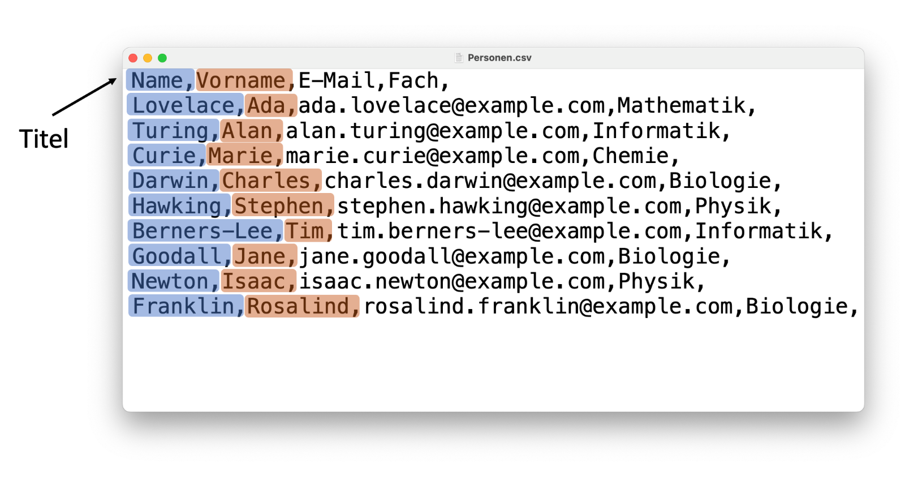
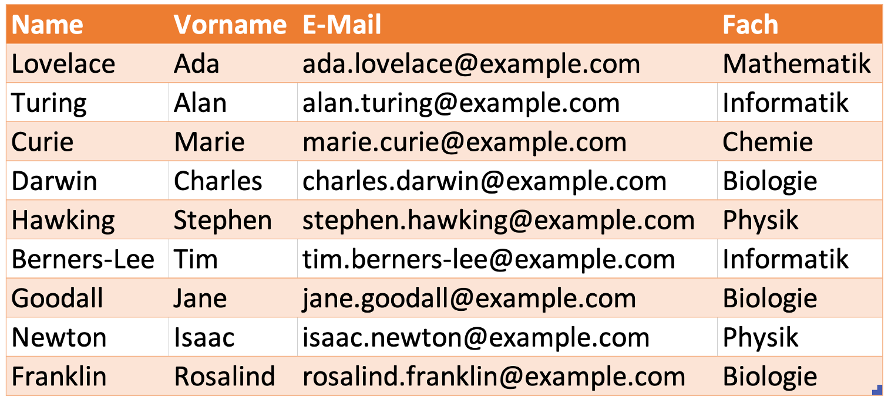
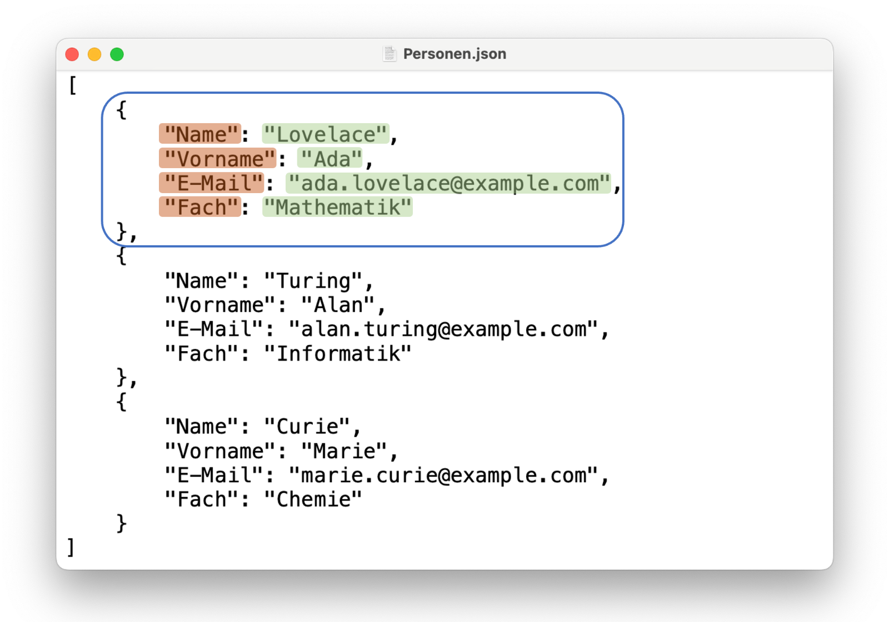
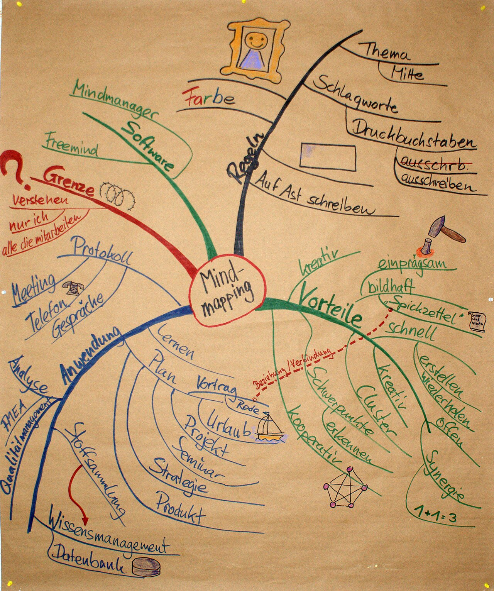
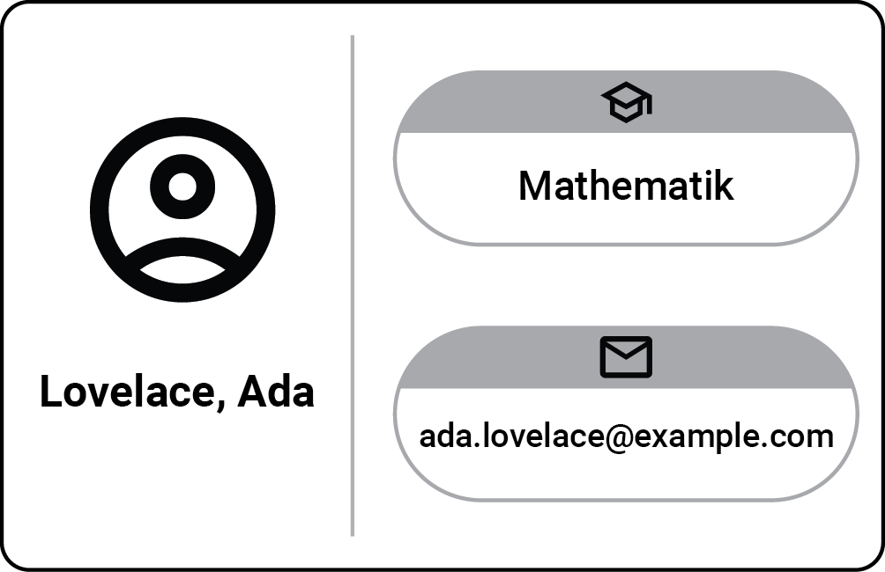
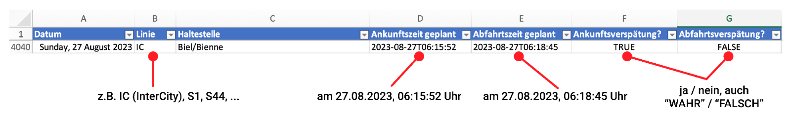
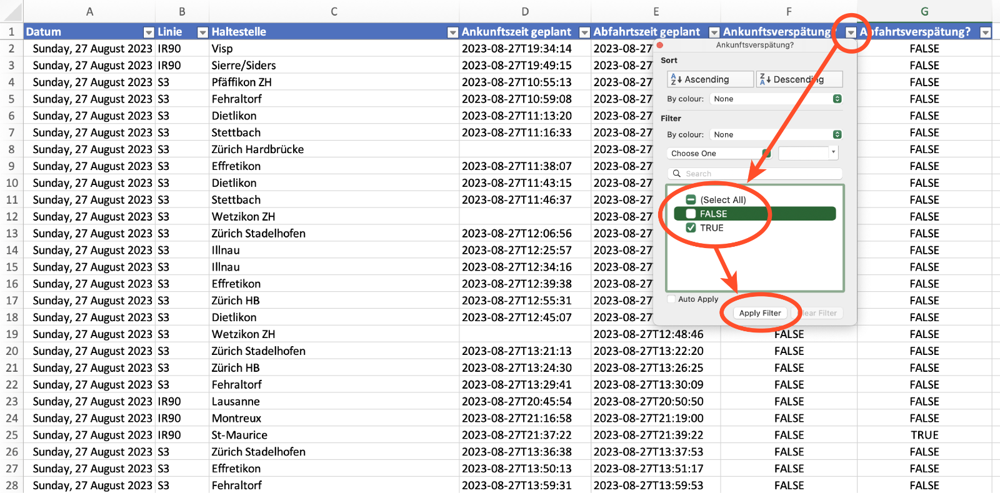
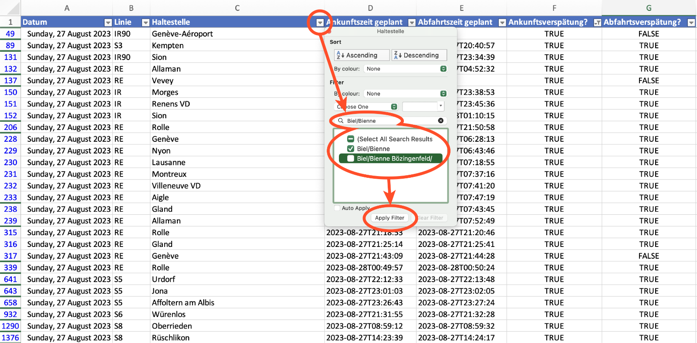
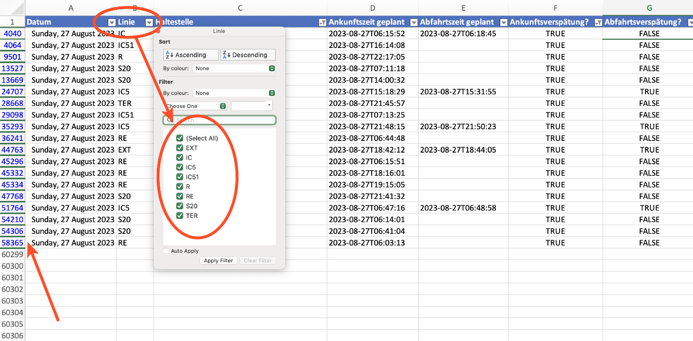

import { CodeEditor } from '@tdev-components/documents/CodeEditor';

# Ansätze zur Datenstrukturierung

## Comma-separated Values (CSV) und Tabellen

Ein einfacher aber effektiver Ansatz zur Strukturierung von Daten ist ein Format namens Comma-separated Values (__CSV__). Der Name beschreibt dabei auch schon fast das gesamte Format: jede Zeile ist genau ein Datensatz, und dessen Datenfelder sind durch Kommata getrennt.



Damit ist dieses Format konzeptuell bereits sehr nahe zu einer __Tabelle__ (beispielsweise in Excel): Dort sind die Datenfelder in einzelnen Zellen untergebracht, welche wiederum in **Zeilen** und **Spalten** organisiert sind.



Im CSV-Format ist es zudem üblich, dass die oberste Zeile keine eigentliche Werte, sondern die "Spaltentitel" enthält - also auch ganz ähnlich wie bei einer Excel-Tabelle. Diese Zeile ist allerdings fakultativ - wer die CSV-Datei verwenden will, muss einfach darüber informiert werden, ob die Datei eine solche Kopfzeile besitzt oder nicht.

Nebst dem Komma kann als Trennzeichen zum Beispiel auch ein Semikolon (`;`) oder ein Leerzeichen (`Leerschlag`, `Tab`) verwendet werden. Wichtig ist dabei nur, dass dieses Trennzeichen nicht auch innerhalb eines Datenfelds vorkommen kann - ansonsten müssen die Datenfelder zusätzlich mit Anführungszeichen `""` eingefasst werden (zum Beispiel "Physik und angewandte Mathematik", falls wir einen Leerschlag als Trennzeichen verwenden).

## JavaScript Object Notation (JSON)

Das der Programmiersprache JavaScript entstammende __JSON__-Format fasst Datensätze als sogenannte Objekte zusammen, die mit geschwungenen Klammern `{ ... }` gekennzeichnet sind. Die Datenfelder eines solchen Datensatzes (also, Objekts) bestehen als **Schlüssel-Wert Paaren** (*Key-Value Pairs*) wie `"Name": "Lovelace"`.

Die Objekte können durch Kommata getrennt und mit eckigen Klammern `[ … ]` umrahmt zu einer Liste (Fachbegriff: *Array*) zusammengefast werden, womit wir eine solche Liste als Datenbank betrachten könnten.



Das Besondere an JSON (und hier der Übersicht halber nicht gezeigt): Bei den Datenfeldern muss es sich nicht immer um Text (z.B. `Lovelace`) oder Zahlen (`5.5`) handeln. Stattdessen kann ein Datenfeld auch wiederum ein Objekt oder eine Liste (*Array*) sein. Man spricht in diesem Fall von verschachtelten *Objekten*.

## Graphen

Ein weiterer Ansatz zur Strukturierung von Daten ist in Form von Graphen. Ein gängiges Beispiel einer solchen Graph-Struktur ist das [Mindmap](https://de.wikipedia.org/wiki/Mindmap).




In der Informatik zudem sehr weit verbreitet sind sogenannte [Bäume](https://de.wikipedia.org/wiki/Baum_(Datenstruktur)).

## Übungen

### 1. Daten strukturieren

Stellen Sie sich folgendes Szenario vor: eine Kolleg:in übergibt Ihnen das folgende "Personenverzeichnis"

```
Alan Turing (alan.turing@example.com) Informatik
marie.curie@example.com: Marie Curie, Chemie
Darwin Charles - Biologie
charles.darwin@example.com
Ada Lovelace ada.lovelace@example.com, Mathematik / Stephen Hawking
(Physik): stephen.hawking@example.com
Tim Berners-Lee, tim.berners-lee@example.com, Informatik
- Jane Goodall / jane.goodall@example.com / Biologie
Isaac Newton, isaac.newton@example.com Physik
Rosalind Franklin: rosalind.franklin@example.com | Biologie
```

mit der Bitte, für jede Person eine solche Visitenkarte zu erstellen:



Damit Sie diesen aufwändigen Prozess nicht von Hand erledigen müssen, wollen Sie ein Programm verwenden, mit dem Sie das Erstellen der Visitenkarten automatisieren können.

:::caution[Das Problem dabei]
Ein Computer versteht die Bedeutung dieser Daten nicht. Er weiss nicht, was ein Vorname oder Nachname, eine E-Mail-Adresse, ein Fach, oder überhaupt eine Person ist. Ein Computer sieht hier lediglich Buchstaben und Zeichen, ohne tieferen Sinn. Sie müssten ihm also Schritt für Schritt erklären, wie er diese Daten interpretieren soll, damit er die Werte für jede Person in dieses Visitenkarten-Schema einfügen kann.
:::

::::aufgabe[Daten strukturieren]
<Answer type="state" id="7ee6ce01-cfb8-42b8-b985-f4abd544a3bb" />

Mit den vorhandenen Daten, so wie sie diese erhalten, wird eine solche Beschreibung schwierig: es gibt kaum eine Regelmässigkeit. Versuchen Sie dann, den Text so umzustrukturieren, dass Sie einem Computer diese Daten sinnvoll beschreiben könnten.

:::tip[Erinnerung]
Computer mögen Regelmässigkeit.

Damit ein Computer diese Daten versteht, müssen Sie mindestens folgende Punkte beschreiben können:
- Wo beginnt jeweils eine Person, wo hört sie auf?
- Wo beginnen und enden pro Person jeweils Vorname, Nachname, E-Mail und Fach?
:::

Im Wesentlichen geht es also darum, die Daten so einheitlich wie möglich darzustellen.

<CodeEditor
  showLineNumbers={false}
  language=""
  id="4a3d9476-6058-4540-ba8c-bb8c59807df1"
  title="personen.txt"
  code={`Alan Turing (alan.turing@example.com) Informatik
marie.curie@example.com: Marie Curie, Chemie
Darwin Charles - Biologie
charles.darwin@example.com
Ada Lovelace ada.lovelace@example.com, Mathematik / Stephen Hawking
(Physik): stephen.hawking@example.com
Tim Berners-Lee, tim.berners-lee@example.com, Informatik
- Jane Goodall / jane.goodall@example.com / Biologie
Isaac Newton, isaac.newton@example.com Physik
Rosalind Franklin: rosalind.franklin@example.com | Biologie`}
/>

::::


### 2. SBB

In der angehängten Excel-Datei finden Sie einen Auszug aus den Ankunfts- und Abfahrtsdaten der SBB für den 20.04.2026. Insbesondere ist darin für jede Linie und Haltestelle vermerkt, ob der Zug dort verspätet angekommen oder abgefahren ist.
Laden Sie die Datei herunter, öffnen Sie diese in Excel, und versuchen Sie, die unten stehenden Fragen zu beantworten. 

Hinweise zum Format der Daten, sowie eine Anleitung zum Filtern von Tabellen in Excel finden Sie ebenfalls unten.


:::aufgabe[SBB-Daten analysieren]
<Answer type="state" id="6a5a8b4e-8f6c-450e-8625-aec2ec3417b9" />

Download der Daten[^1]
: <a href={require("./assets/2026-04-20-daten-sbb.xlsx").default} download="2026-04-20-daten-sbb.xlsx">👉 Daten SBB</a>


Fragen
1. Überlegen Sie sich einen Bahnhof, der sie interessiert (zum Beispiel Biel/Bienne). Gab es an diesem Bahnhof am 20.04.2026 eine Ankunfts-, resp. Abfahrtsverspätung?
    <Answer type="text" id="dd826d31-fc94-441d-b882-62b3e1cf902c" />
2. Welche Linien halten am von Ihnen gewählten Bahnhof?
    <Answer type="text" id="11fa7efd-3bcb-46b4-a6e4-ffce785af230" />
3. Am 20.04.2026 gab es einen Zug, der in Biel Mett verspätet ankam und auch verspätet abfuhr. Wann hätte dieser Zug ankommen sollen?
    <Answer type="text" id="68234225-69b5-4391-a8fb-2898f1ed721f" />
4. Wie viele Haltestellen werden von der Linie IC61 bedient?
    <Answer type="string" id="02ec1703-606e-46c6-9861-cbf74a6fc42d" solution="10" />
:::

### Tipps zum Umgang mit Excel-Tabellen

#### Datenformat



> Hinweis: je nach Betriebssystem, Spracheinstellungen und Version kann Excel bei Ihnen leicht anders aussehen als auf den Bildern gezeigt.

Um eine Spalte nach bestimmten Werten zu filtern, klicken Sie bei der entsprechenden Spalte auf den "Filterknopf" (kleines Dreieck). Mit den Häkchen können Sie anschliessend auswählen, welche Daten Sie anzeigen oder verbergen möchten.

Sobald Sie auf "Apply Filter" ("Filter anwenden") klicken, werden nur noch diejenigen Zeilen angezeigt, die in der soeben gefilterten Spalte einen der Werte enthalten, bei denen Sie ein Häkchen gesetzt haben. In diesem Beispiel werden also anschliessend nur noch Zeilen angezeigt, die in der Spalte "Ankunftsverspätung?" den Wert `TRUE` (WAHR) haben, dan wir das Häkchen bei `FALSE` entfernt haben.



In einigen Spalten (z.B. `Haltestelle` oder `Linie`) gibt es sehr viele verschiedene Werte. Um die Häkchen-Liste trotzdem übersichtlich zu machen, bietet die Filtermaske gerade oberhalb dieser Liste eine Suchfunktion. Sobald Sie dort einen Text eingeben, werden nur noch diejenigen Werte zur Auswahl angeboten, welche den von Ihnen eingegebenen Text enthalten.



Zu guter Letzt wird die Häkchen-Auswahl-Liste auch durch das Filtern der Tabelle reduziert. Die blauen Markierungen bei den Zeilennummern (links) bedeuten, dass in der aktuellen Ansicht bereits einige Zeilen durch Filter ausgeblendet sind - nämlich ist die Tabelle hier bereits so gefiltert, dass nur noch Einträge für die Haltestelle Biel/Bienne angezeigt werden. Die Häkchen-Auswahl für die Spalte `Linie` wird dadurch automatisch auf diejenigen Werte reduziert, die danach noch verfügbar sind - sprich: wir sehen hier nur noch die Linien zur Auswahl, die am Bahnhof Biel/Bienne halten.



## Weitere Datensammlungen

Weitere Datensammlungen zum Ausprobieren:

- https://gurlitt.kunstmuseumbern.ch/de/collection/
- https://opendata.swiss/de
- https://www.who.int/data/collections
- https://data.sbb.ch/explore/?sort=modified
- https://www.fbi.gov/how-we-can-help-you/more-fbi-services-and-information/ucr


[^1]: Quelle [data.sbb.ch](https://data.sbb.ch/explore/dataset/ist-daten-sbb/table/)