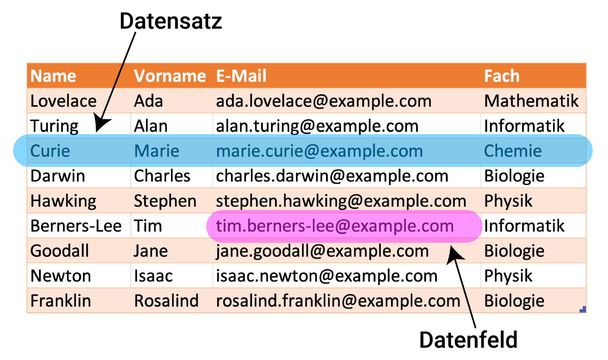

# Daten und Datenbanken

Datenfeld
: Ein Datenfeld ist die kleinste Einheit eines Datensatzes (siehe unten). In der unten stehenden Tabelle können wir die einzelnen Zellen je als ein Datenfeld bezeichnen. In einem Datenfeld finden wir hier einzelne Werte wie beispielsweise die E-Mail Adresse `reto.holzer@example.com`, den Nachnamen Curie, oder das Fach Physik.
Datensatz
: Ein Datensatz ist eine Sammlung von inhaltlich zusammengehörenden Datenfeldern (siehe oben). In der unten stehenden Tabelle können wir die die einzelnen Zeilen je als einen Datensatz bezeichnen: So bilden also beispielsweise die Datenfelder Curie, Marie, `marie.curie@example.com` und Chemie einen Datensatz, weil sie zusammen eine Person namens Marie Curie mit E-Mail Adresse `marie.curie@example.com` und Fach Chemie beschreiben.
Datenbank
: Eine Datenbank ist (umgangssprachlich) eine Ansammlung von Datensätzen. In unserem Beispiel unten könnten wir also die ganze Tabelle insgesamt als Datenbank bezeichnen. Eine Datenbank könnte allerdings auch aus mehreren verschiedenen Tabellen bestehen: Nebst der Personen-Tabelle könnte es zum Beispiel auch noch eine Tabelle mit E-Mail-Adressen und Passwörtern geben, sowie eine Tabelle mit Fächern und Räumen, und so weiter.

Eine genauere Definition des Datenbank-Begriffs im engeren technischen Sinn finden Sie bspw. auf [oinf.ch](https://oinf.ch/kurs/vernetzung-und-systeme/datenbanken/)

