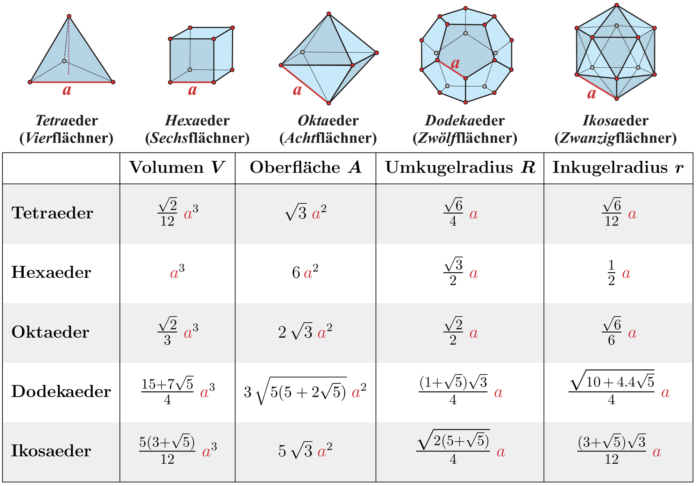

import {toFixedNum, sanitizeNumber} from '@tdev-components/documents/String/sanitizers'

# Math: Taschenrechner

An der Matur am Gymnasium Biel-Seeland erlaubte Taschenrechnermodelle:

:::cards

::br

:::
<Tabs groupId="tr">
    <TabItem label="TI-30X IIS" value="30x">as</TabItem>
    <TabItem label="TI-30 Eco" value="30eco">as</TabItem>
</Tabs>

:::info[Hinweis]
Falls Sie an der Oberstufe einen anderen Taschenrechner verwendet haben, lohnt sich ein frühzeitige Umstellung, damit Sie sich an den neuen Taschenrechner gewöhnen können.
:::


## Übungen
{console.log(toFixedNum((1 + 2 + 9)/3, 3))}
### Grundlegendes
1. Aufgabe
    $$
    \frac{17.38 \cdot 3}{9}
    $$

    <Answer type="string" id="faa44261-c494-4021-8240-9feeb4acaa51" solution={toFixedNum(17.38*3/9, 3)} sanitizer={sanitizeNumber()} />
2. Aufgabe
    $$
    \frac{1 + 2 + (-3)^2}{3}
    $$

    <Answer type="string" id="e5b5cb40-2717-4da4-b9ca-d30710e3d6d5" solution={toFixedNum((1 + 2 + 9)/3, 3)} sanitizer={sanitizeNumber()} />
3. Aufgabe
    $$
    \frac{2}{3}\cdot\frac{2.2}{7.3}\cdot \frac{8.1}{2.7} \cdot 3
    $$

    <Answer type="string" id="e12dc67c-6ef4-4e52-ada6-63cbd71cfb89" solution={toFixedNum(2*2.2*8.1*3/3/7.3/2.7, 3)} sanitizer={sanitizeNumber()} />
4. Aufgabe
    $$
    \frac{7-\sqrt{7^2-4\cdot 2 \cdot (-4)}}{2\cdot 2}
    $$

    <Answer type="string" id="85d81a08-b1c7-4f5c-849d-aee849873ab7" solution={toFixedNum((7-Math.sqrt(7*7+4*2*4))/4, 3)} sanitizer={sanitizeNumber()} />
5. Aufgabe
    $$
    \frac{-(-8)-\sqrt{(-8)^2-4\cdot 2 \cdot 4}}{2\cdot 2}
    $$

    <Answer type="string" id="1db10395-0923-4fbc-b6c9-b14601d05f20" solution={toFixedNum((8-Math.sqrt(8*8-4*2*4))/4, 3)} sanitizer={sanitizeNumber()} />


### Platonische Körper
Es gibt genau $5$ platonische Körper, sog. reguläre Polyeder.



1. Berechnen Sie die Oberfläche eines Dodekaeders mit der angegebenen Kantenlänge und runden Sie das Ergebnis auf 3 Nachkommastellen genau.
    <Answer label="Oberfläche Dodekaeder mit 25 cm" type="string" id="e68063d0-13fb-40a0-816f-606a1edbc5f2" solution={toFixedNum(3*Math.sqrt(5*(5+2*Math.sqrt(5)))*Math.pow(25, 2), 3)} sanitizer={sanitizeNumber(['^2'])} />
    ::::details[Vorgehen und Tipps]

        <Tabs groupId="tr">
            <TabItem label="TI-30X IIS" value="30x">
                ```
                3√(5*(5+2√(5)))*25²
                ```

                :::tip[:mdi[speedometer] Optimierung]
                    Zwischen Faktoren und Wurzeln muss nicht zwingend ein `*` stehen.
                :::
            </TabItem>
            <TabItem label="TI-30 Eco" value="30eco">
            Von Innen- nach Aussen die Klammern berechnen.
            
            [[3]] [[\*]] [[\(]] [[5]] [[\*]] [[\(]] [[5]] [[+]] [[2]] [[\*]] [[5]] [[√x]] [[\)]] [[\)]] [[√x]] [[\*]] [[25]] [[x²]] [[=]]

            Alternativ ohne Klammern (hier möglich, da Zwischenresultate als Faktoren verwendet werden):
            [[5]] [[√x]] [[+]] [[5]] [[=]] [[\*]] [[5]] [[=]] [[√x]] [[\*]] [[3]] [[\*]] [[25]] [[x²]] [[=]]
            
            :::tip[Gleich-Taste]
            Die Gleich-Taste [[=]] berechnet das Resultat - sie soll nur dann verwendet werden, wenn
            - eine Rechnung abegschlossen ist
            - das gesamte bisher Eingegeben als Faktor verwendet werden soll
            :::
            </TabItem>
        </Tabs>
    ::::
    <Answer label="Oberfläche Dodekaeder mit 75 cm" type="string" id="497037d7-dbce-4acd-bf07-669f99f07624" solution={toFixedNum(3*Math.sqrt(5*(5+2*Math.sqrt(5)))*Math.pow(75, 2), 3)} sanitizer={sanitizeNumber(['^2'])} />

    ::::details[Vorgehen und Tipps]

        <Tabs groupId="tr">
            <TabItem label="TI-30X IIS" value="30x">
            Wurde bereits das Resultat für $25\, cm$ berechnet, kann mit der [[:mdi[arrow-up-drop-circle-outline]]] Taste die letzte Eingabe abgerufen und die Kantenlänge auf $75\, cm$ geändert werden.

            :::tip[:mdi[speedometer] Optimierung]
                Steht das Resultat bereits auf dem Display, kann auch mit [[:mdi[arrow-left-drop-circle-outline]]] direkt ans Ende der letzten Rechnung gesprungen werden.
            :::
            </TabItem>
            <TabItem label="TI-30 Eco" value="30eco">
            Nochmals alles eingeben...

            [[3]] [[\*]] [[\(]] [[5]] [[\*]] [[\(]] [[5]] [[+]] [[2]] [[\*]] [[5]] [[√x]] [[\)]] [[\)]] [[√x]] [[\*]] [[75]] [[x²]] [[=]]            
            
            </TabItem>
        </Tabs>
    ::::


2. Berechnen Sie das Volumen eines Ikosaeders auf 3 Nachkommastellen genau:
    
    <Answer label="Volumen Ikosaeder mit 17 cm" type="string" id="0161d2d7-73e7-45e8-9c3f-6a9f34e6b806" solution={toFixedNum(5*(3+Math.sqrt(5))/12*Math.pow(17, 3), 3)} sanitizer={sanitizeNumber(['^3'])} />

    ::::details[Vorgehen und Tipps]
    <Tabs groupId="tr">
        <TabItem label="TI-30X IIS" value="30x">
            ```
            5*(3+√5)/12*17^3
            ```
        </TabItem>
        <TabItem label="TI-30 Eco" value="30eco">
        [[5]] [[\*]] [[\(]] [[3]] [[+]] [[5]] [[√x]] [[\)]] [[÷]] [[12]] [[\*]] [[17]] [[yˣ]] [[3]] [[=]]
        </TabItem>
    </Tabs>
    ::::
    
    <Answer label="Volumen Ikosaeder mit 37 cm" type="string" id="e57bbc99-b989-40ce-9715-328f3cdb467f" solution={(toFixedNum(5*(3+Math.sqrt(5))/12*Math.pow(37, 3)), 3)} sanitizer={sanitizeNumber(['^3'])} />

## Trigonometrische Funktionen


## Zwischenresultate abspeichern


