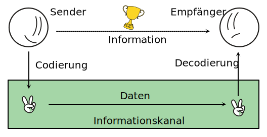

# OF Informatik

# Code

- Information
- Daten
- Code

Note:
- Information: Das Wissen, das ein **Sender** einem **Empfänger** über eine **Information** übermittelt.
- Daten: **Zeichen oder Symbole** zur Darstellung von Informationen.
- Code: Eine "Sprache", die festlegt, wie Informationen in Daten übersetzt werden.

# Code

Note:
Die Informationsübertragung kann nur funktionieren, wenn Sender und Empfänger den gleichen Code verwenden. Bei zwischenmenschlicher Kommunikation ist der Code normalerweise nicht explizit festgelegt. Dann muss der Empfänger den Code erraten, was zu Missverständnissen führen kann.

# Code

> Ein Code ist eine Vorschrift, welche Daten von einer Darstellung in eine andere umwandelt.
> Dabei darf keine Information verloren gehen, eine Rückumwandlung muss möglich sein.

# Code

# Zahlensysteme

Wie lassen sich Zahlen über ein Stromkabel verschicken?

# Zehnersystem

- 10 eindeutige Zeichen

    0, 1, 2, 3, 4, 5, 6, 7, 8, 9
- Jede Stelle wird mit einer Zehnerpotenz multipliziert

# Zehnersystem

# Binärsystem

| $2^8$ | $2^7$ | $2^6$ | $2^5$ | $2^4$ | $2^3$ | $2^2$ | $2^1$ | $2^0$ |
| ----: | ----: | ----: | ----: | ----: | ----: | ----: | ----: | ----: |
|   256 |   128 |    64 |    32 |    16 |     8 |     4 |     2 |     1 |

## Binär -> Dezimal

| $2^8$ | $2^7$ | $2^6$ | $2^5$ | $2^4$ | $2^3$ | $2^2$ | $2^1$ | $2^0$ |      |
| ----: | ----: | ----: | ----: | ----: | ----: | ----: | ----: | ----: | ---: |
|   256 |   128 |    64 |    32 |    16 |     8 |     4 |     2 |     1 |      |
|       |       | **1** | **0** | **1** | **1** | **0** | **0** | **1** |      |

## Binär -> Dezimal

| $2^8$ | $2^7$ | $2^6$ | $2^5$ | $2^4$ | $2^3$ | $2^2$ | $2^1$ | $2^0$ |      |
| ----: | ----: | ----: | ----: | ----: | ----: | ----: | ----: | ----: | ---: |
|   256 |   128 |    64 |    32 |    16 |     8 |     4 |     2 |     1 |      |
|       |       | **1** | **0** | **1** | **1** | **0** | **0** | **1** |      |
|       |       |   +64 |    +0 |   +16 |    +8 |    +0 |    +0 |    +1 |      |

## Binär -> Dezimal

| $2^8$ | $2^7$ | $2^6$ | $2^5$ | $2^4$ | $2^3$ | $2^2$ | $2^1$ | $2^0$ |        |
| ----: | ----: | ----: | ----: | ----: | ----: | ----: | ----: | ----: | -----: |
|   256 |   128 |    64 |    32 |    16 |     8 |     4 |     2 |     1 |        |
|       |       | **1** | **0** | **1** | **1** | **0** | **0** | **1** |        |
|       |       |   +64 |    +0 |   +16 |    +8 |    +0 |    +0 |    +1 | **89** |

# Zeichencodierung

Jedem Zeichen wird eine Zahl zugeordnet.

Das nennt sich **Zeichencodierung**

## Zeichencodierung: ASCII

- `7 bit` Information pro Zeichen
- 33 Steuerzeichen (bspw. neue Zeile)
- 95 normale Zeichen (Buchstaben)

## ASCII

| Zeichen | Zahl | Binär     |
| :------ | :--- | :-------- |
| A       | 65   | `1000001` |
| B       | 66   | `1000010` |
| C       | 67   | `1000011` |
| D       | 68   | `1000100` |
| E       | 69   | `1000101` |
| F       | 70   | `1000110` |
| G       | 71   | `1000111` |

# Namen schreiben

- `0` = weisses Feld
- `1` = schwarzes Feld

<video src="images/paper_tape_shapolab.mp4#t=40,70" controls width="100%" loop></video>

*Verwenden Sie eine Papierunterlage fürs Bemalen*