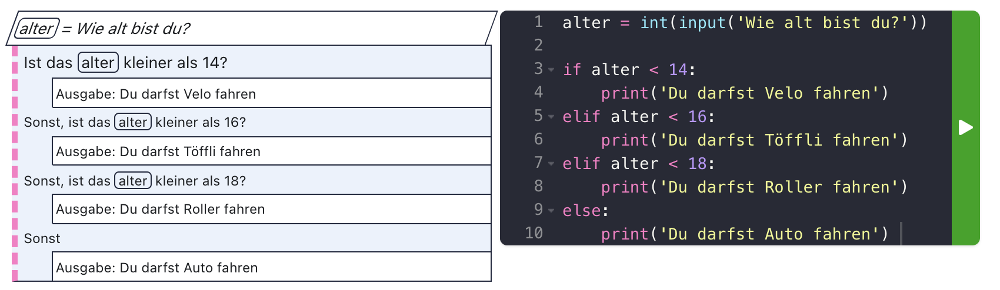

# Bedingte Ausführung ⑂

Ein- oder mehrere Schritte werden nur ausgeführt, wenn eine bestimmte **Bedingung** erfüllt ist.


## Vergleichen

Vergleiche sind die Basis der Entscheidung, ob ein Codeblock ausgeführt wird, oder nicht.


## Vergleichen

Vergleiche sind die Basis der Entscheidung, ob ein Codeblock ausgeführt wird, oder nicht.

Ein Vergleich kann immer als Frage gestellt werden, die mit **Ja** oder **Nein** beantwortet werden kann.


## Beispiel

Finde mit Fragen heraus, ob eine Person alt genug ist, um Auto, Roller, Töffli oder Velo zu fahren.


## Beispiel

Finde mit Fragen heraus, ob eine Person alt genug ist, um Auto, Roller, Töffli oder Velo zu fahren.
- bist du jünger als 14?
- bist du jünger als 16?
- bist du jünger als 18?
- bist du älter als 18?


## Beispiel in Python

Bist du jünger als 14?

```py
alter = input('Wie alt bist du?')
alter = int(alter)

if alter < 14:
    print('Du darfst Velo fahren')
else: # wenn man nicht jünger als 14 ist,
      # ist man sicher 14 oder älter!
    print('Du darfst Töffli fahren')
```


## Beispiel in Python
Weitere Optionen hinzufügen

```py
alter = input('Wie alt bist du?')
alter = int(alter)

if alter < 14:
    print('Du darfst Velo fahren')
elif alter < 16:
    print('Du darfst Töffli fahren')
else:
    print('Du darfst Roller fahren')
```


## Beispiel in Python
Noch mehr Optionen...

```py
alter = input('Wie alt bist du?')
alter = int(alter)

if alter < 14:
    print('Du darfst Velo fahren')
elif alter < 18:
    print('Du darfst Roller fahren')
elif alter < 16:
    print('Du darfst Töffli fahren')
else:
    print('Du darfst Auto fahren')
```
Funktioniert das so?


## Beispiel in Python
Die Reihenfolge der Bedingungen ist wichtig!

<div style="display: flex; gap: 1em;" class="small">

```py
alter = input('Wie alt bist du?')
alter = int(alter)

if alter < 14: # von klein nach gross
    print('Du darfst Velo fahren')
elif alter < 16:
    print('Du darfst Töffli fahren')
elif alter < 18:
    print('Du darfst Roller fahren')
else:
    print('Du darfst Auto fahren')
```
```py
alter = input('Wie alt bist du?')
alter = int(alter)

if alter >= 18: # von gross nach klein
    print('Du darfst Auto fahren')
elif alter >= 16:
    print('Du darfst Roller fahren')
elif alter >= 14:
    print('Du darfst Töffli fahren')
else:
    print('Du darfst Velo fahren')
```
</div>


## Struktogramm

<div class="full">



</div>


# Ausgabe mit `alert`

```py
from browser import alert

alter = input('Wie alt bist du?')
alter = int(alter)
alert(f'In einem Jahr bist du {alter + 1} jährig.')
```