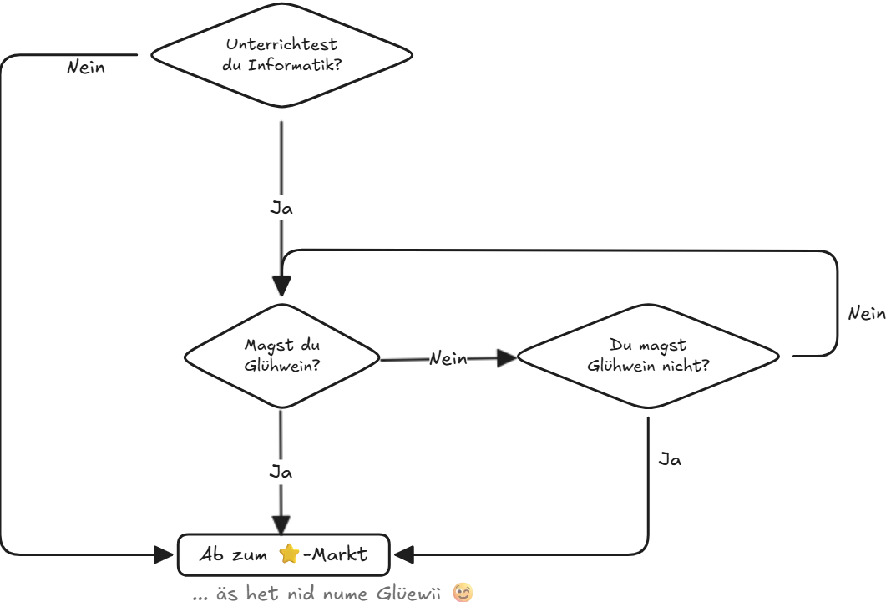

import ProgressState from '@tdev-components/documents/ProgressState';
import Excalidoc from '@tdev/excalidoc/Component';

# Programmieren

## Grüfnisch

<blockquote>

Grüfnisch ist in der Schweiz unter Jugendlichen und Kindern eine verbreitete Spielsprache. Diese Sprache wird von vielen Kindern und Jugendlichen auch als Geheimsprache benutzt. Bei „Grüfnisch“ werden alle Vokale wie folgt ersetzt:[^1]

a
: anafa
e
: enefe
i
: inifi
o
: onofo
u
: unufu
ä
: änäfä
ö
: önöfö
ü
: ünüfü


### Beispiele
Hallo
: Hanafallonofo

Fachschaftstag Informatik
: Fanafachenefeschaftstanag Infanoforninifatik

</blockquote>

:::aufgabe[1. Grüfnisch]
<Answer type="state" id="db0ccb47-0b2c-4cf9-bd58-39eecd4d4d5d" />

Wie lautet der Satz `Hallo, es ist Winter` auf Grüfnisch?
- Löse die Aufgabe von Hand, ohne Programmieren...
- Prüfe, ob deine Antwort stimmt. (Auf das :mdi[help-circle-outline] klicken)
- Markiere die Aufgabe als gelöst. (oben in der Aufgabe auf das Kästchen :mdi[checkbox-blank-outline] klicken...)

<Answer 
    type="string"
    id="800e0d26-b395-4329-af90-58ddf0af3c43"
    solution="hanafallonofo enefes inifist winifintenefer"
    sanitizer={(val) => val.toLowerCase().replaceAll(',', ' ').replaceAll('.', ' ').trim().replaceAll(/\s+/g, ' ')}
    fullWidth
/>

:::

:::::aufgabe[2. Programmiere es...]
<ProgressState id="16a754e9-c991-45e2-9115-9d5023adba60" confirm float='right' preventTogglingFutureSteps>
1. Ändere untenstehendes Programm so, dass der eingegebene Satz auf Grüfnisch übersetzt wird.
    ::::details[Hinweis 1]
    :::def[`.replace(alt, neu)`]
    Mit `replace(alt, neu)` werden **alle** `alt`en Textstücke durch die `neu`en ersetzt. Der Text wird dabei nicht direkt verändert, sondern nur der Rückgabewert (=das Resultat) ist verändert.

    ```py live_py slim
    text = 'Hallo ich bin Alfred. Ich schreibe an einem wichtigen Buch.'

    # Alle "." durch "!!!" ersetzen
    text = text.replace('.', '!!!')

    print(text)
    ```

    :::
    ::::
2. Verwende einen Input-Befehl, damit der Benutzer einen eigenen Satz eingeben kann.
    :::details[Hinweis]
    Mit `input('Anweisung/Frage')` kann der Benutzer einen Text eingeben, welcher dann im Programm weiterverwendet werden kann.

    ```py live_py slim
    text = input('Gib einen Text ein: ')
    print('Du hast folgenden Text eingegeben:', text)
    ```
    :::
3. Testen... Funktioniert dein Code auch, wenn bspw. `Informatik` eingegeben wird? Passe das Programm so an, dass auch Grossbuchstaben richtig übersetzt werden.
    :::details[Hinweis]
    Mit `lower()` oder `upper()` kann ein Text komplett in Klein- oder Grossbuchstaben umgewandelt werden.

    ```py live_py slim
    text = 'Hallo Ich BIN Alfred.'

    text = text.lower() # text kleinschreiben
    print(text)
    ```
    :::
4. (Optional) Lass den Text von Beavis ausgeben...

    ```py live_py slim
    from cowsay import beavis

    beavis('Hallo FATA Informatik!')
    ```
    :::details[Weitere Figuren]

    Anstelle von `cow()` können auch andere Figuren verwendet werden. Diese muss dann aber auch aus der Bibliothek `cowsay` importiert werden.

    - `beavis`
    - `cheese`
    - `daemon`
    - `cow`
    - `dragon`
    - `ghostbusters`
    - `kitty`
    - `meow`
    - `milk`
    - `stegosaurus`
    - `stimpy`
    - `turkey`
    - `turtle`
    - `tux`
    :::
5. (Optional) Lass den Text von der Computerstimme ausgeben...

    ```py live_py slim
    from speech import speak

    speak('Hallo FATA Informatik!')
    ```
    ::::details[Weitere Sprach-Optionen]
    Die Sprachausgabe kann angepasst werden:
    ```py live_py slim
    from speech import speak

    speak('Hi there, i speak english now.', lang='en-US')
    speak('Jetzt doppelt so schnell', lang='de-DE', rate=2)
    speak('Jetzt halb so schnell', lang='de-DE', rate=0.5)
    speak('Jetzt höher', lang='de-DE', pitch=2) # max 2
    speak('Jetzt tiefer', lang='de-DE', pitch=0.1) # min 0.1
    speak('Jetzt leiser', lang='de-DE', volume=0.5) # Werte zwischen 0 und 1, Standard ist 1
    ```
    Es kann auch die __Stimme__ verändert werden, wobei nicht jede Stimme in jedem Browser verfügbar ist.
    ```py live_py slim
    from speech import speak, voices
    voices('de-DE') # gibt die verfügbaren Stimmen aus
    speak('Hallo, es ist Winter!', lang='de-DE', voice='Microsoft Katja - German (Germany)')
    ```

    Die __verfügbaren Sprachen__ können mit `languages()` ausgegeben werden.
    ```py live_py slim
    from speech import speak, languages
    languages()
    ```

    :::warning[Browser-Feature]
    Nicht jeder Browser unterstützt das Sprechen von Texten in allen Sprachen.
    :::
    ::::
</ProgressState>

```py live_py title=gruefinisch.py id=a64ffb37-1c13-445f-83e1-22385ade7a16
text = 'Hallo, es ist Winter!'
print(text)
```

<Solution id="62702964-4f4e-44f7-b081-bcf93b9566b5">
In Kurzschreibweise für den FATA... :mdi[emoticon-cool]{.blue}

```py live_py slim
from cowsay import beavis
from speech import speak
text = input('Gib einen Text ein, der auf Grüfnisch übersetzt werden soll: ')

grüfnisch = text
for vokal in 'aeiouäöü':
    neu = f'{vokal}n{vokal}f{vokal}'
    grüfnisch = grüfnisch.replace(vokal, neu).replace(vokal.upper(), neu.capitalize())
beavis(grüfnisch)
speak(grüfnisch)
```
</Solution>
:::::

:::aufgabe[Flussdiagramm]
<Answer type="state" id="cc310b81-0b57-4ba2-8630-ea3880c0345d" />

Zeichne ein Flussdiagramm, welches den Entscheidungsprozess darstellt, ob man nach dem FATA noch zum Sternenmarkt kommt.

<Excalidoc id="41127181-faf1-4351-981f-f3b9dc3551f4" allowImageInsertion/>

<Solution id="6e2f3cf6-ffdb-4299-918e-47fe7f42b2cc">

</Solution>
:::

## Weiterführende Programmier-Möglichkeiten

### Turtles

```py live_py slim
from turtle import *
color('red', 'yellow')
begin_fill()
while True:
    forward(200)
    left(170)
    p = pos()
    if abs(p[0]) < 1 and abs(p[1]) < 1:
        break
end_fill()
```

### Fraktale

```py live_py slim
from turtle import *

speed(0)
penup()
goto(0, -200)
pendown()
left(90)
def tree(size):
    if size < 5:
        forward(size)
    else:
        forward(size)
        left(35)
        tree(size / 1.5)
        backward(size / 1.5)
        right(100)
        tree(size / 1.5)
        backward(size / 1.5)
        left(65)
tree(120)
```
### Conway's Game of Life

Mehrheitlich undokumentiertes Beispielprogramm - alle Skripts, die im Repository unter [`/static/bry-libs`](https://github.com/lebalz/teaching-inf/tree/main/static/bry-libs) abgelegt sind, können importiert und ausgeführt werden...

```py live_py slim
from grid import Grid
from game import gameloop, sleep

# initial state
grid = Grid.from_text('''
  
 
 
 
 
 
 
 
  
  
  
           xx  xx            
            xx x  
            x  x               
            x  x  
            x xx  
           xx  xx  
           
           
        
        
          
          
          
          
''')

def neighbours(grid, x, y):
    nb = []
    dim_x = len(grid[0])
    dim_y = len(grid)
    for i in range(-1, 2):
        for j in range(-1, 2):
            if not (i == 0 and j == 0):
                ny = (y + i) % dim_y
                nx = (x + j) % dim_x
                nb.append(grid[ny][nx])
    return nb

def live_neighbours(grid, x, y):
    s = 0
    for cell in neighbours(grid, x, y):
        if cell == 'black':
            s += 1
    return s

@gameloop
def evolution(dt):
    current = grid.color_grid
    for x in range(grid.size[1]):
        for y in range(grid.size[0]):
            alive = live_neighbours(current, x, y)
            if current[y][x] == 'black' and 2 <= alive <= 3:
                grid[y][x].color = 'black'
            elif current[y][x] != 'black' and alive == 3:
                grid[y][x].color = 'black'
            else:
                grid[y][x].color = 'white'
    sleep(5)

evolution()
```

### Interaktives Flood-Fill

```py live_py slim
from grid import Grid
from browser import aio

board = Grid.from_text('''
xxxxxxxx
xxxx   x
xx  x  x
x   xxxx
x x  x x
x xxxx x
x  x   x
xxxxxxxx
''')

white = 'rgba(0,0,0,0)'
async def flood_fill(x, y):
    if x < 0 or x >= len(board[0]) or y < 0 or y >= len(board):
        return
    if board[y][x].color == white:
        board[y][x].color = 'red'
        await aio.sleep(0.3)
        await flood_fill(x-1, y)
        await flood_fill(x+1, y)
        await flood_fill(x, y-1)
        await flood_fill(x, y+1)

aio.run(flood_fill(2, 2))
```